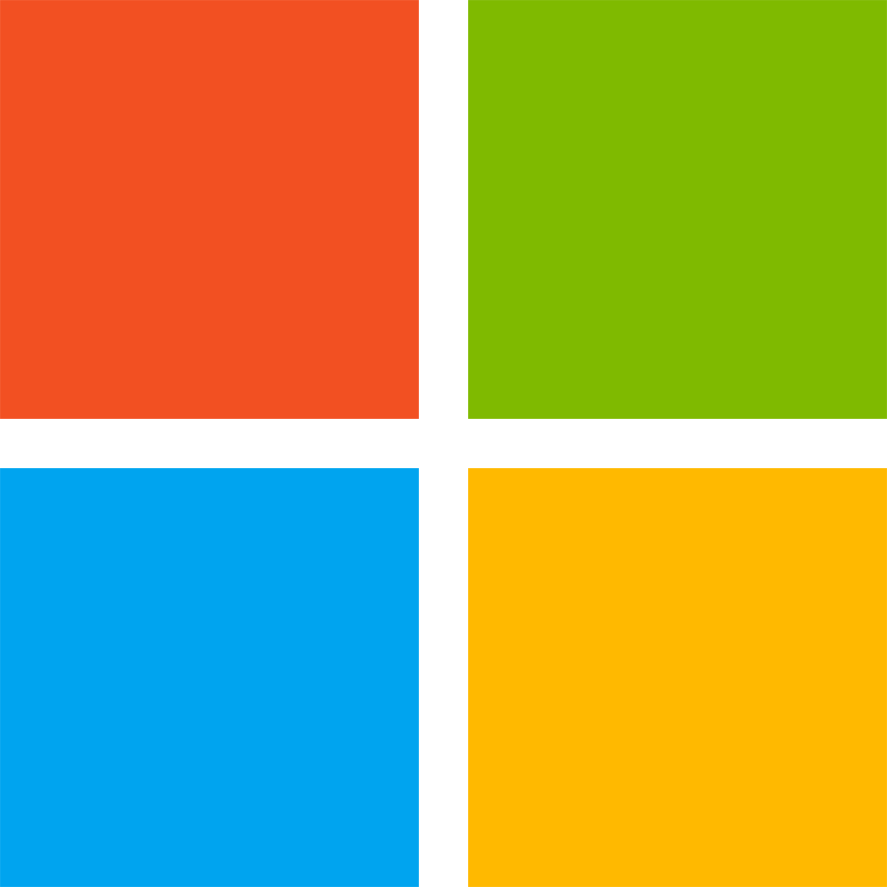
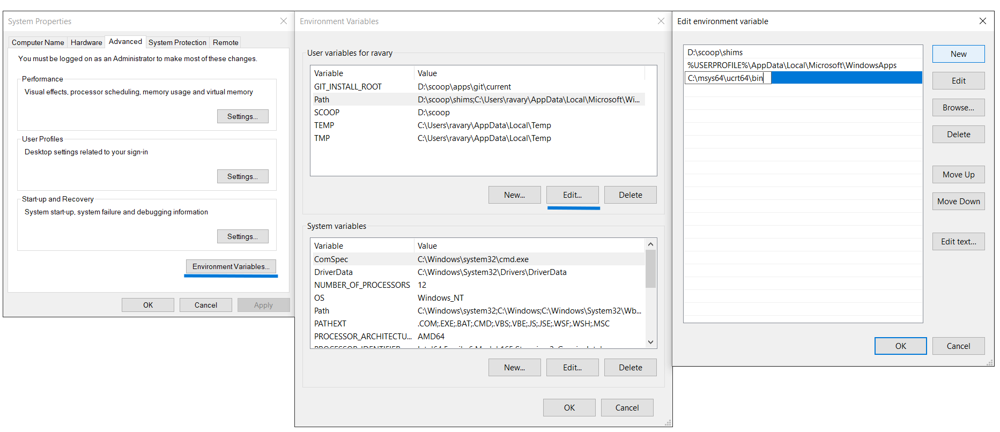
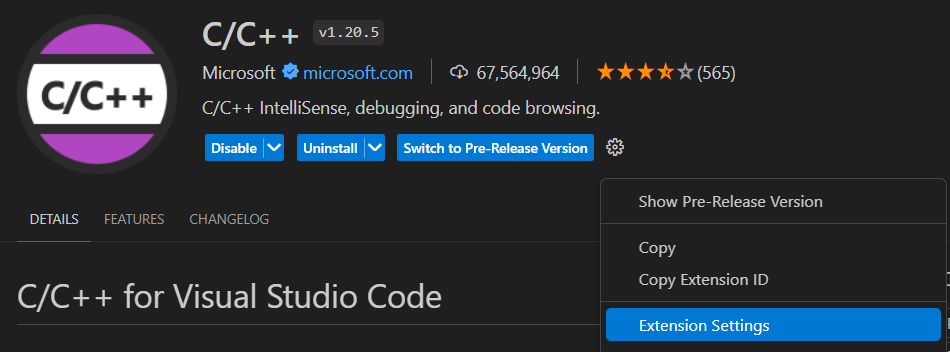
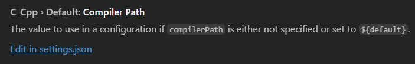

<!-- _class: cover_c -->
<!-- _paginate: "" -->
<!-- _footer: "" -->
<!-- _header:  -->


# <!-- fit -->Entorno de Desarrollo

###### Para la programación competitiva en C++ 

Por Ariel Parra


## ¿Qué se necesita para la programación competitiva?


<script type="module">
  import mermaid from 'https://cdn.jsdelivr.net/npm/mermaid@10/dist/mermaid.esm.min.mjs';
  mermaid.initialize({ startOnLoad: true });
</script>
<div class="mermaid" style="text-align: center;">
graph TD;
    A[Editor de Textos] --> B[Compilador]
    B -->|Código compilado| C[Terminal]
    D[IDE] --> B
    C -->|Ejecución| E[Resultados] 
    E -->|validación| F[Juez Virtual] 
</div>

## Codeforces 

está es la plataforma que estaremos usando para el curso, por lo que ocupamos crear una cuenta a través de <https://codeforces.com/register>. La razón por la cual usamos está plataforma es que tiene múltiples problemas de distintas categorías y dificultades, donde al subir cada problema se evaluara con un juez virtual (virtual judge) que juzgara si nuestro código soluciona el problema o en que caso/s no lo cumple.

Para el acompañamiento del curso, se puede recurrir al [Junior Training Sheet V7.0](https://cpc-gallos.github.io/blog/Junior_Training_sheet/), donde hay múltiples problemas ordenados por dificultad con links directos a codeforces. 

## IDEs

Un IDE (Integrated Development Environment) es una aplicación que combina múltiples herramientas para el desarrollo de software en una sola interfaz. Generalmente, un IDE cuenta con las siguientes características:

- <mark>Editor de código:</mark> editor de texto que ayuda a escribir el código de software con funciones como el resaltado de la sintaxis con indicaciones visuales, el relleno automático específico para el lenguaje y la comprobación de errores a medida que se escribe el código.

- <mark>Automatización de compilaciones:</mark> herramientas que automatizan las tareas sencillas y repetitivas como parte de la creación de una compilación local del software para que use el desarrollador, como la compilación del código fuente de la computadora en código binario, el empaquetado de ese código y la ejecución de pruebas automatizadas.

- <mark>Depurador (Debuger):</mark> programa que sirve para probar otros programas y mostrar la ubicación de un error en el código original de forma gráfica.

## DEV-C++  

<!-- _class: pin-3 -->

<div class="tdiv">

Este es el IDE favorito de los profesores. El principal problema es que la versión original incluye una versión antigua de GCC (4.9.2) aparte solo estar disponible en Windows.

Si se quiere usar este IDE, mi recomendación es usar el [DEV-C++ "Rojo" (embarcadero)](https://www.embarcadero.com/es/free-tools/dev-cpp) ya que este incluye un compilador más moderno (TDM-GCC 9.2.0), pero aun así  solo sigue estando disponible en Windows.
</div>

<div class="limg">


</div>

<div class="rimg">


</div>

## Code::Blocks 

<!-- _class:  bq-red -->

Este es uno de los IDEs más populares entre las competencias de programación, debido a que es de código abierto, no pesa mucho, incluye compilador para Windows y ser compatible con Linux y MacOS.

> Si lo descargas para Windows, descarga la versión que diga 'mingw' para que incluya el compilador


## JetBrains CLion 

<!-- _class:  bq-purple -->

Este es el IDE de C++ por excelencia en la industria, aunque sea propietario es usado por múltiples empresas como Google, Nasa, BMW, etc.

Este IDE es expansible a través de plugins, todas las herramientas necesarias para desarrollar en C++ y aparte es multiplataforma siendo compatible en Windows, MacOS y Linux. 

Las desventajas serian su amplio uso de recursos y su elevado costo anual de más de $100 USD.

> Pero este es [gratis](https://www.jetbrains.com/community/education/#students) mientras seas un estudiante y al egresar tendrás  un 40% de descuento!
 


## VScode 

No confundir con Visual Studio . VScode es el editor por excelencia del Club, esto debido a ser de código abierto, multiplataforma al estar desarrollado con Electron (básicamente es una app web), tener editor en línea, su implementación con git, y principalmente por su amplio catalogo de extensiones con los cuales podemos desarrollar en cualquier lenguaje y de múltiples maneras. La única desventaja es que no incluye el compilador de C++, por lo que tendremos que instalarlo manualmente.
Para instalarlo podemos hacerlo desde su página web o usando el gestor de paquetes integrado en Windows `winget` a través de una terminal (Powershell ), con el comando: 
```powershell
winget install -e --id  Microsoft.VisualStudioCode --override '/SILENT /mergetasks="!runcode,addcontextmenufiles,addcontextmenufolders"'
```

## Extensiones para VScode 

-  [C/C++](https://marketplace.visualstudio.com/items?itemName=ms-vscode.cpptools) está es la extensión necesaria para poder correr código de C++ dentro de VScode
- [code runner](https://marketplace.visualstudio.com/items?itemName=formulahendry.code-runner) está es una extensión opcional que acelera el proceso de compilación en VScode
- [Error lens](https://marketplace.visualstudio.com/items?itemName=usernamehw.errorlens) está extensión nos muestra los errores que va dando el IDE o el compilador.
- [Prettier](https://marketplace.visualstudio.com/items?itemName=esbenp.prettier-vscode) está extensión le da formato a nuestro código al presionar la combinación de teclas `shift + alt + F`
- [Competitive Programming Helper](https://marketplace.visualstudio.com/items?itemName=DivyanshuAgrawal.competitive-programming-helper) está es la extensión para poder, probar los códigos antes de publicar y también podremos subir directamente los códigos a codeforces de una manera muy rápida

#### Temas recomendados: 
 [Material Icon Theme](https://marketplace.visualstudio.com/items?itemName=PKief.material-icon-theme), [nord](https://marketplace.visualstudio.com/items?itemName=arcticicestudio.nord-visual-studio-code),  [catppuccin](https://marketplace.visualstudio.com/items?itemName=Catppuccin.catppuccin-vsc),  [GruvBox](https://marketplace.visualstudio.com/items?itemName=jdinhlife.gruvbox),  [Monokai Pro](https://marketplace.visualstudio.com/items?itemName=monokai.theme-monokai-pro-vscode) o  [dracula](https://marketplace.visualstudio.com/items?itemName=dracula-theme.theme-dracula) 


## Instalar el compilador de C++ en Windows 

<!-- _class:  bq-red -->

> Para otros sistemas o dispositivos, visite el blog: <https://cpc-gallos.github.io/blog/Entorno_Desarrollo/>

1. Descargar el gestor de paquetes `msys2` desde su página oficial [www.msys2.org/](https://github.com/msys2/msys2-installer/releases/download/2024-05-07/msys2-x86_64-20240507.exe) o desde el gestor de paquetes integrado en Windows `winget` a través de una terminal (Powershell ), con el comando: 
```powershell
winget install -e --id MSYS2.MSYS2
```
2. Ya instalado, abrimos la terminal de MSYS2 UCRT64  y ejecutamos este comando:

```powershell
pacman -S --needed base-devel mingw-w64-ucrt-x86_64-toolchain
```

---

Acepta presionando `Enter` 2 veces.


3. Ya terminada la instalación del compilador, procederemos a agregar el compilador al `path`. Para ello, buscamos alguna de estas palabras clave: "variables", "path", "variables del sistema" en el buscador de Windows <i class="fa fa-magnifying-glass"></i> y abriremos la aplicación con icono de una computadora con una palomita , allí abriremos las variables y editaremos el path agregando la dirección: `C:\msys64\ucrt64\bin`.

---



---

4. ya instalada la extensión del compilador C/C++ en VScode iremos hacia las configuraciones de la extensión.



5. Ahi buscamos la opción que diga "compiler path", la cual nos mandara nos manda al archivo `settings.json`



---

6. Agregaremos estas lineas a los corchetes internos, teniendo cuidado de no borrar otras configuraciones. 

```json

    "C_Cpp.default.compilerPath": "C:/msys64/ucrt64/bin",
    "C_Cpp.clang_format_path": "C:/msys64/ucrt64/bin",
    "code-runner.executorMap": {
        "cpp": "cd $dir && g++ $fileName -o $fileNameWithoutExt -g && $dir$fileNameWithoutExt"
    }

```
7. Con esto ya podremos compilar y ejecutar el código dentro de VScode dándole click al símbolo de reproducir  <i class="fa fa-play"></i>  en la parte superior derecha del editor o con la extensión [code runner](https://marketplace.visualstudio.com/items?itemName=formulahendry.code-runner) presionando las teclas `ctrl + alt + N`.

## Integrar Codeforces   con VScode  

<!-- _class:  bq-red -->

1. Primero en VScode tenemos que tener la extensión [Competitive Programming Helper (CPH)](https://marketplace.visualstudio.com/items?itemName=DivyanshuAgrawal.competitive-programming-helper)

1. Después cambiaremos el lenguaje por defecto a C++ y agregaremos la ruta (ubicación) de la [plantilla del club](https://cpc-gallos.github.io/blog/Plantilla/) a la configuración de la extensión Competitive Programming Helper (CPH) en VScode

1. Para <i class="fa-brands fa-firefox-browser"></i> firefox: Agrega las extensiones: [competitive companion](https://addons.mozilla.org/en-US/firefox/addon/competitive-companion/?utm_source=addons.mozilla.org&utm_medium=referral&utm_content=search) y [CPH Submit](https://addons.mozilla.org/en-US/firefox/addon/cph-submit/)

1. Para navegadores basados en <i class="fa-brands fa-chrome"></i> chromium (<i class="fa-brands fa-chrome"></i> Google Chrome, <i class="fa-brands fa-edge"></i> Microsft Edge, <i class="fa-brands fa-opera"></i> Opera, <i class="fa-brands fa-brave"></i> Brave, etc.): Agrega las extensiones: [competitive companion](https://chromewebstore.google.com/detail/competitive-companion/cjnmckjndlpiamhfimnnjmnckgghkjbl) y [CPH Submit](https://chromewebstore.google.com/detail/cph-submit/ekplnobooikgpdbobcciehbhcmlklgnc)

Para usarlas, ten tu sesión de codeforces activa y también ten abierto VScode, cuando abras un problema en codeforces haz click en , después cámbiate a VScode donde veras unas opciones donde eligieras cpp, y listo podrás probar y publicar tu código desde vscode. 


## Git  y Github 

<!-- SCM: Source code management -->

Git (git-scm) es una herramienta de código abierto para el control de versión distribuido mientras que GitHub es una plataforma y servicio basado en la nube, propiedad de Microsoft, para el desarrollo de software y el control de versiones utilizando Git, básicamente un servidor donde almacenas tus proyectos y los controlas con Git.

En el club recomendamos usar git para guardar tus códigos en GitHub, esto es útil no solo para las actividades del club, sino que podrás usar estas habilidades para tus próximos proyectos escolares o profesionales.


### Para conectar Git  con Github 

1. Primero crearemos una cuenta de GitHub en <https://github.com/signup> 
1. Después creamos un repositorio (proyecto) en  <https://github.com/new>
1. Luego descargamos git desde la página oficial <https://git-scm.com/downloads> o con el gestor de paquetes integrado en Windows `winget` a través de una terminal, con el comando: 
```powershell
winget install -e --id Git.Git
```
4. Si Windows no está en la última versión, comprobamos que está instalado el cliente de [OpenSSH](https://learn.microsoft.com/en-us/windows-server/administration/openssh/openssh_install_firstuse?tabs=gui).
5. En una terminal (Powershell  o git-bash ) creamos nuestro usuario local de git con los comandos:

```powershell
git config --global user.name "Usuario"
git config --global user.email "correo@ejemplo.com" 
```

---

6. comprobamos nuestros datos con el comando:
```powershell
 git config --list
 ```

7. En la misma terminal creamos una llave pública de ssh:

```powershell
ssh-keygen -t ed25519 -C "correo@ejemplo.com"
```

8. Copiamos los datos del archivo generado en `C:\Users\%USERNAME%\.ssh\id_ed25519.pub` (en Windows tiene icono de Microsoft publisher  y se puede abrir con el bloc de notas) y lo conectamos con nuestra cuenta de github através de <https://github.com/settings/ssh/new>, dándole un nombre (puede ser el modelo de tu computadora) y pegando la los datos copiados (llave).

---
<!-- _class:  bq-red -->

9. Por último descargamos nuestro repositorio, en una terminal navega hacia tu carpeta de destino, yo recomiendo la carpeta de Documentos (Documents) o Escritorio (Desktop).

> Mucho ojo 👁️ en Windows, estas carpetas suelen estar bajo 'C:\\Users\\%USERNAME%\\One Drive\\'

```bash
git clone git@github.com:"Usuario de GitHub"/"Proyecto".git
```

10. Una vez ya tengamos conectado nuestra cuenta y hallamos descargado el proyecto, los tres comandos principales de git que usaremos (ya están integrados en VScode <i class="fa fa-code-branch"></i>) son:

```powershell
git commit -m "mensaje del commit" # cambios locales a "pushear"
git push # pusheas los cambios junto con el commit hacia GitHub
git pull # descargas los cambios actuales desde GitHub
```

## Documentación del lenguaje C++

- [Tabla de valores ASCII](https://theasciicode.com.ar/) al trabajar con `char` y `string` es útil ver está tabla
- [Microsoft Learn](https://learn.microsoft.com/es-es/cpp/cpp/cpp-language-reference?view=msvc-170) aunque está enfocado en su compilador MSVC tiene información muy valiosa sobre el lenguaje 
- [cplusplus](https://cplusplus.com/reference/) vienen clases por librería y ejemplos de cada una de las funciones
- [CPPRefernece](https://en.cppreference.com/w/) muy similar a cplusplus
- [W3school](https://www.w3schools.com/cpp/default.asp) tutoriales interactivos para aprender C++
- [GeeksForGeeks](https://www.geeksforgeeks.org/c-plus-plus/) una de las mejores comunidades de programadores proporcionan estos blogs. 
- [CPPbyExample](https://cppbyexample.com/) ejemplos muy útiles de varios temas de C++
- [GNU libstdc++](https://gcc.gnu.org/onlinedocs/libstdc++/latest-doxygen/classes.html) está página es muy técnica, pero te muestra las implementaciones de la STL de C++

## Referencias

- GitHub. (s.f). *Generating a new SSH key and adding it to the ssh-agent*. Recuperado de <https://docs.github.com/en/authentication/connecting-to-github-with-ssh/generating-a-new-ssh-key-and-adding-it-to-the-ssh-agent?platform=windows>
- Josal. (2024). *What is an IDE? – Integrated Development Environment*. Recuperado de <https://www.geeksforgeeks.org/what-is-ide/>
- RedHat. (2023). *¿Qué es y para qué sirve un IDE?*. Recuperado de <https://www.redhat.com/es/topics/middleware/what-is-ide>.
- VScode. (s.f). *Using GCC with MinGW*. Recuperado de <https://code.visualstudio.com/docs/cpp/config-mingw>