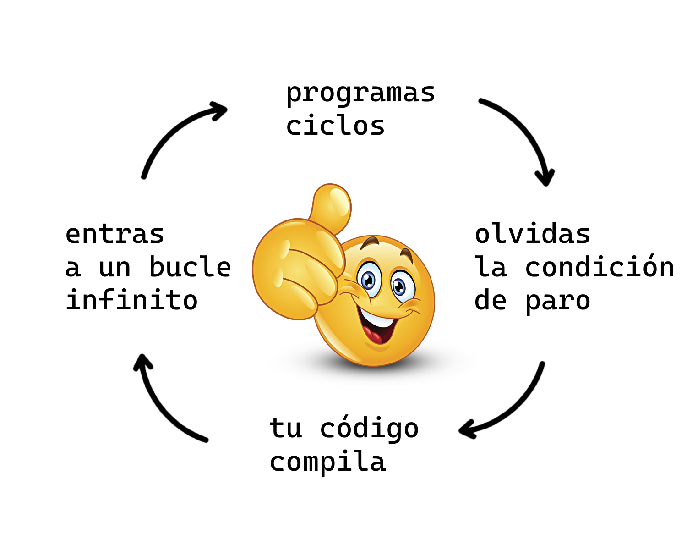

<!-- _class: cover_b -->
<!-- _paginate: "" -->
<!-- _footer: "" -->

# <!-- fit -->Control de Flujo 


Por Ariel Parra

## Condicionales


###  Tablas de verdad para operadores booleanos

<!-- _class: cols-3 -->

<div class="ldiv center">

#### NOT ( `!` )

| p | ¬p |
|---|----|
| F | V  |
| V | F  |
</div>

<div class="mdiv center">

#### AND ( `&&` )

| p | q | p ∧ q |
|---|---|-------|
| F | F | F     |
| F | V | F     |
| V | F | F     |
| V | V | V     |
</div>

<div class="rdiv center">

#### OR ( `||` )

| p | q | p ∨ q |
|---|---|-------|
| F | F | F     |
| F | V | V     |
| V | F | V     |
| V | V | V     |
</div>

### if

<style scoped>
pre {
    margin: 0;
    padding: 16px;
    font-size: 17.5px;
}
</style>

- Sin identacion

```c++
bool programo, estudio = true;
if(programo) cout << "verdadero";
else
    cout << "falso";
```

- Con identacion

```c++
if( programo == true ) {
    cout << "Aprendo, ";
}else if (programo != true){
    cout << "Procrastino, ";
}
if ( programo && estudio ) {
    cout << "tendre exito en competencias";
} else if ( programo || estudio ) {
    cout << "quiza tenga exito";
} else {
    cout << "pues no tendre exito";
}
```

### Operador Ternario

El operador ternario en C++ es una forma compacta de escribir una declaración if-else que siempre devuelve un valor, dependiendo de una condición. Primero se escribe la condición booleana, seguida del operador `?`, que indica el valor que se devolverá si la condición es verdadera. Después del operador `:`, se coloca el valor que se devolverá si la condición es falsa.

```c++
cout << (programo ? "Aprendo, " : "Procrastino, ");
```
```c++
cout << (programo && estudio ? "tendre exito en competencias" : (programo || estudio ? "quiza tenga exito" : "pues no tendre exito"));
```

### Switch-case

Permite evaluar una expresión y ejecutar diferentes bloques de código de manera eficiente, en este caso `a` es la expresión evaluada y solamente puede ser numerica (`int` / `long long`) o un caracter (`char`).

```c++ 
switch(a) { 
    case 'A': case '1':
        cout << "solo caracteres 'A' y '1'";
        break;
    case 'a' ... 'z': 
        cout << "letras minusculas"; 
        break; 
    case 0 ... 10:
        cout << "numeros del 0 al 10"; 
        break;
    default:
        cout << "lo demas";
} 
```

## Ciclos



### for 

- for tradicional
```c++
for (size_t i=0; i < n; ++i) {
    cout << n << " ";
}
```
- for de rango
```c++
for (int numero : numeros) {
    cout << numero << " ";
}
```

### while

- while 
```c++
int i = 0;
while (true) {
    cout << i;
    if (i++ > n) break;
}
```
- do-while
```c++
int i = 0;
cout<<endl;
do {
    cout << ++i;
} while (i < n);
```
## Progresiones

<style scoped>
pre {
    margin: 0;
    padding: 16px;
}
</style>

#### Progresiones aritméticas

```c++
int a = 5, d = 3, n = 10;
for (int i = 0; i < n; ++i) {
    cout << a + i * d << " ";
}
```
#### Progresiones geometricas
```c++
int a = 5, r = 3, n = 10;
for (int i = 0; i < n; ++i) {
   cout << a * pow(r, i) << " ";
}
```

### Progresiones aritméticas
<style scoped>
pre {
    margin: 0;
    padding: 16px;
    font-size: 17.5px;
}
</style>
<!--
a_n es el término n-ésimo.
a_1 es el primer término.
n es el número del término.
d es la diferencia común. 
-->

- **Fórmula del término n-ésimo:**
$$ a_n = a_1 + (n - 1) \cdot d $$
```c++
   int an = a1 + (n - 1) * d;
```

- **Fórmula de la suma de los primeros n términos:**

$$ S_n = \frac{n}{2} \cdot (2a_1 + (n - 1) \cdot d) $$

```c++
    int sn = ( n * (2 * a1 + (n - 1) * d) ) /2;
```
- o de manera equivalente:

$$ S_n = \frac{n}{2} \cdot (a_1 + a_n) $$


### Progresiones geométricas

<!--
a_n es el término n-ésimo.
a_1 es el primer término.
n es el número del término.
r es la razón común.
-->

<style scoped>
pre {
    margin: 0;
    padding: 16px;
}
</style>

- **Fórmula del término n-ésimo:**

$$ a_n = a_1 \cdot r^{(n - 1)} $$

```c++
    int an = a1 * pow(r, n - 1);
```

- **Fórmula de la suma de los primeros n términos:**

Para `r != 1`:

$$ S_n = a_1 \cdot \frac{1 - r^n}{1 - r} $$

```c++
    int Sn = a1 * (pow(r, n) - 1) / (r - 1);
```

- **Fórmula de la suma de una progresión geométrica infinita (cuando `|r| < 1`):**

$$ S = \frac{a_1}{1 - r} $$

## Sumatorias (Σ)

<!-- 
i=1: Es el índice de la sumatoria. En el código, es la variable de iteración del bucle for. Donde 1 es el valor inicial.

n: Es el valor final del índice i. En el código, corresponde a la condición de paro del bucle i <= n.

i: Es el término general que se suma. En el código, es lo que se suma a la variable sum en cada iteración sum += i.
-->

La sumatoria (notación sigma: Σ) se usa para sumar una secuencia de términos. 

$$
\sum_{i=1}^{n} i
$$
```c++
int n = 10, sum = 0;
for (int i = 1; i <= n; ++i) {
    sum += i;
}
```

## Multiplicatorias (Π)

<!-- 
i=1: Es el índice de la sumatoria. En el código, es la variable de iteración del bucle for. Donde 1 es el valor inicial.

n: Es el valor final del índice i. En el código, corresponde a la condición de paro del bucle i <= n.

i: Es el término general que se multiplica. En el código, es lo que se multiplica por la variable product en cada iteración product *= i.

-->

La multiplicatoria o producto (notación pi: Π) se usa para multiplicar una secuencia de términos. 

$$
\prod_{i=1}^{n} i
$$

```c++
int n = 5, product = 1;
for (int i = 1; i <= n; ++i) {
    product *= i;
}
```

## Condiciones de salto

- `break`: Termina el bucle o la declaración switch y transfiere el control a la declaración inmediatamente siguiente.
```c++
for (int i = 1; i <= 10; ++i) {
    if (i == 5) break;
    cout << i << " ";
}
```
- `continue`: Omite la iteración actual de un bucle y continúa con la siguiente iteración.
```c++
for (int i = 1; i <= 10; ++i) {
    if (i == 5) continue;
    cout << i << " ";
}
```

---

<style scoped>
pre {
    margin: 0;
    padding: 16px;
}
</style>

- `return`: Sale de una función y devuelve un valor al llamador.
```c++
int sumar(int a, int b) {
    return a + b;
}
int resultado = sumar(3, 4);
cout << resultado << endl;
```

- `goto`: Transfiere el control a una declaración etiquetada dentro de la misma función. (Nota: puede crear código ilegible y propenso a errores, pero también puede solucionar problemas con la recursión).
```c++
int i = 1;
start:
    if (i > 5) goto end;
    cout << i << " ";
    ++i;
    goto start;
end:
```


## Funciones  


## Nesting
<style scoped>
pre {
    margin: 0;
    padding: 16px;
    font-size: 17.5px;
}
</style>

El nesting ocurre cuando anidamos condicionales dentro de otro. Esto lleva a un código difícil de leer.

```c++
inline void foo() {
    if (var) {
        if (qux) {
            if (baz) {
                cout << "Todas las condiciones son verdaderas";
            } else {
                cout << "baz es falso";
            }
        } else {
            cout << "qux es falso";
        }
    } else {
        cout << "var es falso";
    }
}
```

## Inversión
<style scoped>
pre {
    margin: 0;
    padding: 16px;
    font-size: 17.5px;
}
</style>

Consiste en manejar los casos negativos primero y usar declaraciones return para salir del flujo de control lo antes posible.
```c++
inline void foo() {
    if (!var) {
        cout << "var es falso";
        return;
    }
    if (!qux) {
        cout << "qux es falso";
        return;
    }
    if (!baz) {
        cout << "baz es falso";
        return;
    }
    cout << "Todas las condiciones son verdaderas";
}
```

## Extracción
<style scoped>
pre {
    margin: 0;
    padding: 16px;
    font-size: 17.5px;
}
</style>


Consiste en dividir el código en funciones más pequeñas y específicas para mejorar la legibilidad.

```c++
inline void checkBaz() {
    if (!baz) {
        cout << "baz es falso";
        return;
    } cout << "Todas las condiciones son verdaderas";
}
inline void checkQux() {
    if (!qux) {
        cout << "qux es falso";
        return;
    } checkBaz();
}
inline void foo() {
    if (!var) {
        cout << "var es falso";
        return;
    } checkQux();
}
```

### Branching y Branchless

El término branching se refiere a las condicionales, cuando el programa diverge en dos caminos puede llegar a ser lento en ciertos casos debido a que el CPU intenta adelantarse precagargando una de las funciones posibles. La metodologia branchless evita eso, pero puede volver menos legible la funcion.

```c++
inline int menorBranch(int a, int b) {
    if (a < b)  
        return a;
    return b;
}
```
```c++
inline int menorBranchLess(int a, int b) {
    return a * (a < b) + b * (b <= a);
}
```
        
### Lambda λ

Las lambdas o funciones lambda permiten definir funciones anónimas de forma concisa. Son útiles para crear funciones cortas que se utilizan en el contexto de otra función, como en algoritmos STL.

La sintaxis básica de una lambda es:
```c++
[capturas](parámetros) -> tipo_retorno {
    // Cuerpo de la función
};
```

Un ejemplo:

<!--
auto nos ahorra escribir: 
std::function<int(int, int)> suma = [](int a, int b) -> int {
    return a + b;
};
-->

```c++
auto suma = [](int a, int b) -> int { return a + b; };
int res = suma(5, 3);
```
## Problemas

- [**4A** Watermelon](https://codeforces.com/contest/4/problem/A)
- [**1968A** Maximize?](https://codeforces.com/contest/1968/problem/A)

## Referencias

- Ceibal. (s.f.). *Tablas de verdad*. Recuperado de <https://rea.ceibal.edu.uy/elp/logica-para-informatica/tablas_de_verdad.html>
- code_r. (2024). *Control flow statements in Programming*.  Recuperado de <https://www.geeksforgeeks.org/control-flow-statements-in-programming/>
- CodeAesthetic. (2022). *Why You Shouldn't Nest Your Code* [video]. Recuperado de <https://youtu.be/CFRhGnuXG-4?si=wgfGJZ_vRLuDxTXS>
- cplusplus. (s.f.). *Statements and flow control*. Recuperado de <https://cplusplus.com/doc/tutorial/control/>
- Creel. (2020). *Branchless Programming: Why "If" is Sloowww... and what we can do about it!*. Recuperado de <https://youtu.be/bVJ-mWWL7cE?si=JYBcGTo3mglW2WHn>
- Low Level Learning. (2023). *why are switch statements so HECKIN fast?* [video]. Recuperado de <https://youtu.be/fjUG_y5ZaL4?si=EtUvRm3a93P4KJqx>
- sagar. (2023). *C++ Ternary or Conditional Operator*.  Recuperado de <https://www.geeksforgeeks.org/cpp-ternary-or-conditional-operator/>
- The Cherno. (2017). *CONDITIONS and BRANCHES in C++ (if statements)* [video]. Recuperado de <https://youtu.be/qEgCT87KOfc?si=-1Jxhs49mCNDVBvV>