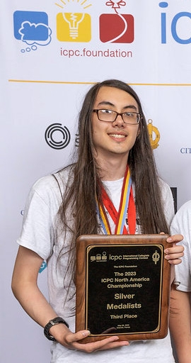

<!-- _class: cover_e -->
<!-- _paginate: "" -->
<!-- _footer:  -->
<!-- _header:  -->

# <!-- fit -->Problem Solving

Por Ariel Parra

## Recordemos la ley de Kidlin 

> "Si escribes el problema claramente, entonces tienes la mitad de la solución"

O en inglés:

> “If you write the problem down clearly, then the matter is half solved.”

La razón de que esta sea la frase del grupo, no solo es porque suene bonito o inspirador, sino para recordarnos que no podemos hacer un problema sin entender como funciona primero. 

## Analisis de un problema

¿Cuál es la cantidad mínima de estos tetrominós en forma de 'L' (con altura h y base de 2) necesaria para formar un cuadrado?

Donde la primer y unica entrada es un numero entero `h`, que sera la altura. ( 0 <= h <= 10^12 )


<!-- visualizar el ejercicio en el pizarron para el caso h = 4 respuesta 20 -->

## Primer acercamiento

```c++
int main() {
  int h;
  cin >> h;
  int altura_rectangulo = h + 1; 
  int area_rectangulo = 2 * altura_rectangulo;  
  int base_cuadrado = lcm(2,altura_rectangulo); // MCM
  int area_cuadrado = base_cuadrado * base_cuadrado;
  int tetrominos = (area_cuadrado / area_rectangulo ) * 2;
  cout << tetrominos;
  return 0;
}
```

<!-- Preguntar que le falta (le falta def cases, long long y quitar lcm -->

## Solución optimizada

```c++
int main() {
  unsigned long long h;
  cin >> h;
  if(h<=1) {
      cout<<h;
      return 0;
  }
  ull altura_rectangulo = h + 1; 
  ull area_rectangulo = 2 * altura_rectangulo;  
  ull base_cuadrado = (altura_rectangulo % 2 == 0) ? altura_rectangulo : 2 * altura_rectangulo;
  ull area_cuadrado = base_cuadrado * base_cuadrado;
  ull tetrominos = (area_cuadrado / area_rectangulo ) * 2;
  cout << tetrominos;
  return 0;
}
```

## La tecnica de "5 why's" de TOYOTA

> Desarrollada por **Taiichi Ohno** en Toyota, la técnica de los "Cinco Porqués" está basada en la filosofía japonesa de mejora continua (Kaizen). Su objetivo es encontrar la causa raíz de los problemas a través de preguntas repetitivas.

La técnica se trata de preguntar "¿por qué?" repetidamente, normalmente cinco veces, hasta llegar a la causa subyacente del problema. Sin embargo, puede requerir más o menos preguntas dependiendo del caso.

- **Dificultades en la implementación**: Aunque es sencilla de aplicar en teoría, en la práctica requiere paciencia, trabajo en equipo, análisis y tiempo de reflexión. Es necesario basarse en hechos comprobables y evitar suposiciones para obtener resultados efectivos.

- **Enfoque en la causa raíz**: El éxito de la técnica radica en ir más allá de los síntomas superficiales para llegar a las causas reales que originan el problema, evitando que resurjan en el futuro. Solo atacando la causa raíz se soluciona el problema de manera definitiva.

- **Advertencias**: La técnica puede ser insuficiente si no se aplican las preguntas correctamente, si se detiene el análisis en los síntomas, o si no se basan las respuestas en datos reales. Además, diferentes equipos podrían llegar a causas distintas para el mismo problema si no se siguen estos principios de forma rigurosa.

## Ejemplo de "5 why's"


---

> **Problema**: El Lincoln Memorial, un monumento en memoria del presidente Lincoln en Washington, está deteriorándose hasta el punto de estar en peligro de venirse abajo.

- **Por qué #1** **¿Por qué se está deteriorando el monumento?**  
    Porque las sustancias químicas utilizadas en la limpieza del monumento son muy abrasivas.

- **Por qué #2** **¿Por qué es necesario utilizar estas sustancias químicas?**  
    Porque es necesario limpiarlos de los excrementos de las aves de la zona donde está situado.

- **Por qué #3** **¿Por qué hay tantos excrementos de ave en el monumento?**  
    Debido al gran número de arañas en el monumento y en sus alrededores, que sirven de alimento a las aves de la zona.

- **Por qué #4** **¿Por qué hay un gran número de arañas en el monumento y en sus alrededores?**  
    Porque, durante el anochecer, un gran número de insectos, de los cuales se alimentan las arañas, se sitúan en el monumento.

- **Por qué #5** **¿Por qué hay tantos insectos en el monumento durante el anochecer?**
    Porque las luces del monumento, en este momento, atraen a los insectos de la zona.

- **Solución**: Cambiar las horas de iluminación del monumento para evitar la atracción de insectos.


## Consejos para dominar el inconsciente

#### Por Colin Galen



## Claves para la Intución 
 

1. **Naturaleza de la intuición**: La intuición es una parte rápida e inconsciente del cerebro, basada en patrones previos y experiencias acumuladas. Actúa como un "sexto sentido" que permite reconocer soluciones de manera casi instantánea.
   
2. **Relación con la programación**: La intuición es crucial en problemas de programación competitiva, ayudando a identificar patrones y soluciones rápidamente. Practicar problemas difíciles mejora la intuición.

3. **Método de mejora**: Para fortalecer la intuición, es útil leer problemas difíciles y sus soluciones, creando conexiones mentales entre problemas y patrones de solución. Este proceso permite que el cerebro reconozca elementos familiares en nuevos problemas.

4. **Balance entre intuición y razonamiento**: Aunque la intuición es poderosa, también es necesario combinarla con razonamiento lógico y ser capaz de justificar las soluciones.

5. **Intuición y genética**: la mejora de la intuición se basa más en la **experiencia y la práctica** que en la genética, y que todos pueden entrenar y desarrollar su capacidad de razonamiento e intuición.


### Entender el contexto 

Entender el contexto es clave en el aprendizaje, y muchas veces no es suficiente aprender un solo concepto a la vez. A veces necesitas juntar varias piezas, pero intenta minimizar esto tanto como sea posible para evitar una complejidad innecesaria. El objetivo es descomponer cada pieza hasta que sea tan simple que no pueda dividirse más.

#### El poder del inconsciente

Tu mente inconsciente controla gran parte de tus procesos mentales más poderosos, como la intuición y la creatividad, y realiza la mayoría de los pensamientos en segundo plano. De hecho, la mente inconsciente se considera cientos o miles de veces más poderosa que la mente consciente. Personas exitosas suelen saber cómo enfocar la mente inconsciente en sus objetivos, permitiendo que ésta trabaje en los problemas incluso mientras realizan otras actividades.

Para lograr este nivel de efectividad en tu aprendizaje, es esencial involucrar al inconsciente en tus objetivos. Aquí te dejamos un enfoque paso a paso que combina principios conscientes y del inconsciente para un aprendizaje profundo:

### Paso a paso para aprender eficientemente

1. **Preocúpate por el concepto**: Para que la mente inconsciente se involucre, debes preocuparte genuinamente por el concepto que estás aprendiendo. Este paso es clave para activar la mente inconsciente, ya que la emoción y el interés son fundamentales para que la mente se enfoque. Relaciona el concepto con motivaciones emocionales como el deseo de éxito o el temor al fracaso.

2. **Intenta inventar la pieza**: Antes de profundizar en cómo funciona un concepto, intenta resolver o crear el problema por ti mismo. Este esfuerzo no solo activa tu mente consciente, sino que también prepara el terreno para que tu inconsciente busque soluciones de manera creativa. Al intentar resolver algo sin tener todas las respuestas, tu mente inconsciente comienza a explorar opciones y enfoques.

3. **Entiende el problema**: El poder del inconsciente también se basa en una comprensión profunda del problema. Cuanto más claro sea para ti lo que intentas resolver, más fácil será que tu mente inconsciente trabaje en segundo plano para encontrar soluciones. Identifica el problema y su contexto.

4. **Explora y refuerza**: Después de intentar resolver el problema por ti mismo, examina la solución. Descomponla en piezas más pequeñas y comprende cómo cada una de ellas encaja en el panorama general. Aquí es donde el condicionamiento entra en juego: refuerza lo que has aprendido visualizando tus éxitos o asociando el proceso con emociones fuertes. Este enfoque ayuda a que tu mente inconsciente priorice y retenga la información.

---

5. **Explica el concepto**: Si puedes explicar un concepto de manera clara y efectiva, significa que lo entiendes. Pero además de confirmar tu comprensión consciente, al verbalizarlo o enseñarlo, involucras de nuevo a tu inconsciente, solidificando el aprendizaje. Si sientes que tu explicación no es clara, investiga los huecos y busca reforzar esos puntos débiles.

6. **Explora variaciones**: La mente inconsciente es especialmente poderosa cuando se la desafía a pensar en múltiples posibilidades. Experimenta mentalmente con variaciones y diferentes escenarios, y cuestiona tus suposiciones. Cuantas más alternativas consideres, más fortaleces tu comprensión del concepto y tu inconsciente sigue explorando soluciones incluso cuando no estás conscientemente trabajando en ello.

7. **Repite regularmente**: La repetición diaria es esencial para acondicionar tu mente inconsciente. Practicar aunque sea unos minutos al día puede hacer una gran diferencia. Al involucrarte con un concepto de forma constante, tu mente inconsciente construye asociaciones fuertes, facilitando la retención y el recuerdo. Este es el poder de la repetición y el acondicionamiento a largo plazo.


<!-- recomendar no caer en el sindrome del impostor o no creerse capaz, ya que siempre podemos mejorar -->

## Problemas

- [**294A** Shaass and Oskols](https://codeforces.com/contest/294/problem/A)
- [**1566A** Median Maximization](https://codeforces.com/contest/1566/problem/A)

## Referencias


- Colin Galen. (2022). *Focusing Your Unconscious Mind: Learn Hard Concepts Intuitively (And Forever)* [video]. Recuperado de <https://youtu.be/Dm68uFy6gus?si=8NbZ9LC5w7l6JPXb>
- Colin Galen. (2022). *Unlocking Your Intuition: How to Solve Hard Problems Easily* [video]. Recuperado de <https://youtu.be/1f6N2UrCK6o?si=sV8nRYm904zIjQI3>
- Colin Galen. (2023). *3-Minute Mental Hack to Take Control of Your Subconscious* [video]. Recuperado de <https://youtu.be/zHECSAdJjTQ?si=TVtQAe5BSCQw3IbC>
- Colin Galen. (2023). *How to Train Yourself to Visualize Anything (6 Simple Tips & Habits) * [video]. Recuperado de <https://youtu.be/p4xFVJTyJZg?si=HCWg8hbqJpSLNE9H>

---

- Ferronato, G. (2023). *La Ley de Kidlin*. Recuperado de https://gxlivemarketing.com/post/la-ley-de-kidlin
- Hast_tag. (2023). *Mastering Competitive Programming: A Guide to Solving Questions on Codeforces*. Recuperado de <https://codeforces.com/blog/entry/116762>
- Saad, M. (s.f.). *Thinking Techniques*. Recuperado de <https://sites.google.com/site/mostafasibrahim/programming-competitions/thinking-techniques>
- Serrat, O. (2009). *The Five Whys Technique*. Recuperado de <https://www.adb.org/sites/default/files/publication/27641/five-whys-technique.pdf>
- Toyota Material Handling. (2019). *¿Por qué? ¿Por qué? ¿Por qué?*. Recuperado de <https://blog.toyota-forklifts.es/5-porques>
