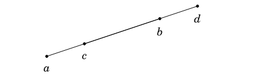
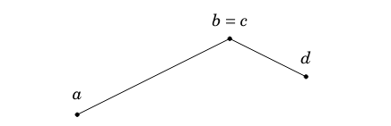
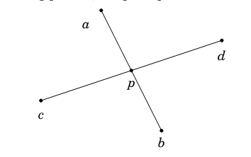

<!-- _class: cover_e -->
<!-- _paginate: "" -->
<!-- _footer:  -->
<!-- _header:  -->

# <!-- fit -->  Geometría computacional

Por Ariel Parra,


## Complex numbers 

Para el manejo de números complejos en c++ existe la libreria `<complex>` donde dichos números complejos tienen la forma `a + bi`, donde `a` es la parte real y `b` la imaginaria. Por lo tanto, podemos hacer que `a` sea la coordenada `x` ỳ `b` coordenada `y`. ¡Pues los números complejos se pueden representar como vectores de 2D.

Entonces podemos definir un tipo de dato `point` con el cual podemos realizar operaciones de vectores necesarias para los planos.
```c++
typedef complex<double> point; // cannot be declared as integer, abs() will fail
#define x real() // or `#define x() real()` to use x as a variable
#define y imag() // or `#define y() real()` to use y as a variable
// Example
point a = 2, b(3, 7), c = {4, 2};
    cout << a << ' ' << b << ' '<< c << endl; // (2, 0) (3, 7) (4, 2)
    cout << a + b << endl;         // (5, 7)    
    cout << "ax = " << a.x << ", ay = " << a.y << endl; // ax =  2, ay = 0
```

## Ejercicio en Clase

Dado un `vector<point> v;` completa la función lambda o realiza una función de tipo auto para ordenar las partes reales de dichos puntos en orden ascendente, y si dos numeros reales son iguales se tendra que ordenar los numeros imaginarios de igual manera, para después imprimir los elementos del vector.
```c++
    #define all(a) (a).begin(), (a).end() 
    typedef complex<double> point;
    vector<point> v = { {3, 4}, {1, 2}, {3, 2}, {1, 3} };

    sort(all(v), [](const point& a, const point& b) {
        return //...;
    });
    for (//...) {
        cout << "(" << p.x << ", " << p.y << ")" << endl;
    }
```
<!-- 5 minutos para resolver-->

## Solución

```c++
vector<point> v = { {3, 4}, {1, 2}, {3, 2}, {1, 3} };

    sort(all(v), [](const point& a, const point& b) {
        return a.x != b.x ? a.x < b.x : a.y < b.y;
    });
   for (const point& p: v) {
        cout << "(" << p.x << ", " << p.y << ")" << endl;
    }
    /*
    (1, 2)
    (1, 3)
    (3, 2)
    (3, 4)
    */

```

## Points and lines

El **producto cruz** ${\mathbf{a} \times \mathbf{b}}$ de dos vectores ${\mathbf{a} = (x_1, y_1)}$ y ${\mathbf{b} = (x_2, y_2)}$ se calcula con la fórmula:

$$
\mathbf{a} \times \mathbf{b} = x_1 y_2 - x_2 y_1
$$


El resultado del producto cruz puede interpretarse como:
- Si ${\mathbf{a} \times \mathbf{b} > 0}$, el vector ${\mathbf{b}}$ gira hacia la izquierda con respecto a ${\mathbf{a}}$.
- Si ${\mathbf{a} \times \mathbf{b} = 0}$, los vectores son colineales y ${\mathbf{b}}$ no gira respecto a ${\mathbf{a}}$.
- Si ${\mathbf{a} \times \mathbf{b} < 0}$, el vector ${\mathbf{b}}$ gira hacia la derecha con respecto a ${\mathbf{a}}$.


## Point location

El **producto cruz** se puede usar para determinar si un punto está ubicado a la izquierda o derecha de una línea definida por dos puntos. Supongamos que la línea pasa por los puntos ${\mathbf{s_1}}$ y ${\mathbf{s_2}}$, y estamos mirando desde ${\mathbf{s_1}}$ hacia ${\mathbf{s_2}}$. Queremos determinar la posición del punto ${\mathbf{p}}$.

El cálculo se realiza con el producto cruz:

$$
(\mathbf{p} - \mathbf{s_1}) \times (\mathbf{s_2} - \mathbf{s_1})
$$

- Si el producto cruz es **positivo**: el punto ${\mathbf{p}}$ está ubicado **a la izquierda** de la línea.
- Si el producto cruz es **negativo**: el punto ${\mathbf{p}}$ está ubicado **a la derecha** de la línea.
- Si el producto cruz es **cero**: los puntos ${\mathbf{s_1}}$, ${\mathbf{s_2}}$ y ${\mathbf{p}}$ están **alineados**.


## Distance functions


<!-- La Verde es Euclideana y las demas Manhattan equivalentes-->
## Euclidean Distance

La distancia euclidiana mide la longitud de la línea recta entre dos puntos en un espacio n-dimensional. Para dos puntos ${ A = (x_1, y_1) }$ y ${ B = (x_2, y_2) }$:

$${
d_E(A, B) = \sqrt{(x_2 - x_1)^2 + (y_2 - y_1)^2}
}$$

En un espacio tridimensional (${A = (x_1, y_1, z_1)}$, ${B = (x_2, y_2, z_2)}$):

$${
d_E(A, B) = \sqrt{(x_2 - x_1)^2 + (y_2 - y_1)^2 + (z_2 - z_1)^2}
}$$

## Manhattan Distance  
La distancia Manhattan, también conocida como distancia de "taxista" o distancia "cuadrada", mide la suma de las diferencias absolutas en cada dimensión entre dos puntos ${ A = (x_1, y_1) }$ y ${ B = (x_2, y_2) }$:

$${
d_M(A, B) = |x_2 - x_1| + |y_2 - y_1|
}$$

En un espacio tridimensional (${A = (x_1, y_1, z_1)}$, ${B = (x_2, y_2, z_2)}$):

$${
d_M(A, B) = |x_2 - x_1| + |y_2 - y_1| + |z_2 - z_1|
}$$


## Point distance from a line


---


La distancia más corta ${ d }$ entre un punto ${ \mathbf{p} }$ y una línea definida por los puntos ${ \mathbf{s_1} }$ y ${ \mathbf{s_2} }$ se deriva comparando el área del triángulo formado por ${ \mathbf{s_1}, \mathbf{s_2}, \mathbf{p} }$ en dos formas:

1. El área en términos de ${ d }$:
   $$
   \text{Área} = \frac{1}{2} |\mathbf{s_2} - \mathbf{s_1}| d
   $$

2. El área como producto cruzado:
   $$
   \text{Área} = \frac{|(\mathbf{s_1} - \mathbf{p}) \times (\mathbf{s_2} - \mathbf{p})|}{2}
   $$

Igualando estas dos expresiones y despejando ${ d }$, obtenemos:

$$
d = \frac{|(\mathbf{s_1} - \mathbf{p}) \times (\mathbf{s_2} - \mathbf{p})|}{|\mathbf{s_2} - \mathbf{s_1}|}
$$

## Line segment intersection

Este problema consiste en determinar si dos segmentos de línea, ${ \overline{ab} }$ y ${ \overline{cd} }$, se intersectan. Las posibles situaciones son:

#### Caso 1: Los segmentos están sobre la misma línea y se solapan
En este caso, hay un **número infinito de puntos de intersección**. Por ejemplo, en la siguiente ilustración, todos los puntos entre ${ \mathbf{c} }$ y ${ \mathbf{b} }$ son puntos de intersección:




Para verificar esta situación:
1. **Usar productos cruzados** para confirmar que todos los puntos están en la misma línea.
2. **Ordenar los puntos** y comprobar si los segmentos se solapan.


### Caso 2: Los segmentos tienen un vértice común como único punto de intersección
En este caso, el punto de intersección es exactamente uno de los vértices de los segmentos. Por ejemplo:



Es fácil verificar este caso, ya que solo hay **cuatro posibilidades**:
1. ${ \mathbf{a} = \mathbf{c} }$
2. ${ \mathbf{a} = \mathbf{d} }$
3. ${ \mathbf{b} = \mathbf{c} }$
4. ${ \mathbf{b} = \mathbf{d} }$


### Caso 3: Hay un único punto de intersección que no es vértice de ningún segmento
En este caso, los segmentos se intersectan en exactamente **un punto ${ \mathbf{p} }$** que no es vértice. Por ejemplo:



Para determinar si los segmentos se intersectan:
1. **Verificar que los puntos ${ \mathbf{c} }$ y ${ \mathbf{d} }$** están en diferentes lados de la línea a través de ${ \mathbf{a} }$ y ${ \mathbf{b} }$.
2. **Verificar que los puntos ${ \mathbf{a} }$ y ${ \mathbf{b} }$** están en diferentes lados de la línea a través de ${ \mathbf{c} }$ y ${ \mathbf{d} }$.

Esto se puede hacer usando **productos cruzados**.

## Pick’s theorem for a polygon area 

El **teorema de Pick** proporciona una manera de calcular el área de un polígono siempre que todos los vértices del polígono tengan coordenadas enteras. Según este teorema, el área del polígono se calcula como:

$$
A = a + \frac{b}{2} - 1
$$

Donde:
- ${ a }$: es el número de puntos enteros **dentro** del polígono.
- ${ b }$: es el número de puntos enteros **en la frontera** del polígono.


## Vector Operations using C++ Complex (point)

Given:
- `a = (2, 3)`
- `b = (4, 1)`

1. **Vector addition/substraction:** `a + b`,`a - b`, **Example:** `(2, 3) + (4, 1) = (2 + 4, 3 + 1) = (6, 4)`
2. **Scalar multiplication/division:** `r * a`,`r / a`, **Example:** If `r = 3`, then `3 * (2, 3) = (3 * 2, 3 * 3) = (6, 9)`
3. **Dot product:** `(conj(a) * b).x`, **Example:** `(2 * 4 + 3 * 1) = 8 + 3 = 11`
4. **Cross product:** `(conj(a) * b).y`, **Example:** `(2 * 1 - 3 * 4) = 2 - 12 = -10`
5. **Squared distance:** `norm(a - b)`,**Example:** `((2 - 4)^2 + (3 - 1)^2) = (-2)^2 + (2)^2 = 4 + 4 = 8`
6. **Euclidean distance:** `abs(a - b)`, **Example:** `sqrt((2 - 4)^2 + (3 - 1)^2) = sqrt(8) ≈ 2.83` 
7. **Angle of elevation:** `arg(b - a)`, **Example:** `atan2(1 - 3, 4 - 2) = atan2(-2, 2) = -π/4 ≈ -0.785 radians`
8. **Slope of line `(a, b)`:** `tan(arg(b - a))`, **Example:** Slope = `(1 - 3) / (4 - 2) = -2 / 2 = -1`

---

Given:
- `a = (2, 3)`, `b = (4, 1)`, `c = (4, 1)`, `v = (4, 1)`
- `p = (3, 2)`
- `theta = π / 4` (45°)
- `r = 5` (radius)

9. **Polar to cartesian:** `polar(r, theta)`  
   **Example:** `x = r * cos(theta) = 5 * cos(π / 4) ≈ 3.54`, `y = r * sin(theta) = 5 * sin(π / 4) ≈ 3.54`, Result: `(3.54, 3.54)`

10. **Cartesian to polar:** `point(abs(p), arg(p))`
    **Example:** `r = sqrt(3^2 + 2^2) = sqrt(9 + 4) = sqrt(13) ≈ 3.61`, `theta = atan2(2, 3) ≈ 0.588 radians`, Result: `(3.61, 0.588)`

11. **Rotation about the origin:** `a * polar(1.0, theta)`  
    **Example:** `rotated = (2 * cos(π / 4) - 3 * sin(π / 4), 2 * sin(π / 4) + 3 * cos(π / 4)) = (2 * 0.707 - 3 * 0.707, 2 * 0.707 + 3 * 0.707)`, Result: `(-0.707, 3.536)`

12. **Rotation about pivot `p`:** `(a - p) * polar(1.0, theta) + p`  
    **Example:** `relative = (2 - 3, 3 - 2) = (-1, 1)`, `rotated = (-1 * cos(π / 4) - 1 * sin(π / 4), -1 * sin(π / 4) + 1 * cos(π / 4)) = (-0.707 - 0.707, -0.707 + 0.707) = (-1.414, 0)`, `final = (-1.414 + 3, 0 + 2) = (1.586, 2)`

---


13. **Angle `ABC`:** `abs(remainder(arg(a - b) - arg(c - b), 2.0 * M_PI))` 
    **Example:** `arg(a - b) = atan2(3 - 2, 2 - 3) = atan2(1, -1) = π / 4`, `arg(c - b) = atan2(1 - 2, 4 - 3) = atan2(-1, 1) = -π / 4`, `angle = abs(remainder(π / 4 - (-π / 4), 2π)) = abs(π / 2)`, Result: `π / 2 ≈ 1.57 radians`

14. **Project `p` onto vector `v`:** `v * dot(p, v) / norm(v)`  
    **Example:**`dot(p, v) = 3 * 4 + 2 * 1 = 12 + 2 = 14`  
    `norm(v) = 4^2 + 1^2 = 16 + 1 = 17`  
    `projection = (4, 1) * (14 / 17) ≈ (3.29, 0.82)`
15. **Project `p` onto line `(a, b)`:** `a + (b - a) * dot(p - a, b - a) / norm(b - a)`  
    **Example:** 
    `b - a = (4 - 2, 1 - 3) = (2, -2)`  
    `p - a = (3 - 2, 2 - 3) = (1, -1)`  
    `dot(p - a, b - a) = 1 * 2 + (-1) * (-2) = 2 + 2 = 4`  
    `norm(b - a) = 2^2 + (-2)^2 = 4 + 4 = 8`  
    `projection = (2, 3) + (2, -2) * (4 / 8) = (2, 3) + (1, -1) = (3, 2)`

---

16. **Reflect `p` across line `(a, b)`:** `a + conj((p - a) / (b - a)) * (b - a)`  
    **Example:** `a = (2, 3)`, `b = (4, 1)`, `p = (3, 2)`  
    Result: `(3, 2)` (reflection is identical because the point lies on the line)

17. **Intersection of line `(a, b)` and `(p, q)`:**
```c++
point intersection(point a, point b, point p, point q) {
  double c1 = cross(p - a, b - a), c2 = cross(q - a, b - a);
  return (c1 * q - c2 * p) / (c1 - c2); // undefined if parallel
}
```
## Problema

- [**1466A** Bovine Dilemma](https://codeforces.com/problemset/problem/1466/A)

## Referencias 

- Bacherikov, O. (2016). *Geometry: 2D points and lines [Tutorial]*. Recuperado de <https://codeforces.com/blog/entry/48122>
- Caleb, A & Gabbita, S. (2021).*Computational Geometry*. Recuperado de <https://activities.tjhsst.edu/sct/lectures/2021/2021_03_26_Computational_Geometry.pdf>
- Di, W. (2012). *C++ complex class: issues with abs() and norm()*. Recuperado de <https://codeforces.com/blog/entry/3885?f0a28=2>
- Laaksonen, A. (2018). *Competitive Programmer’s Handbook*. Recuperado de <https://cses.fi/book/book.pdf>
- Lecomte, V. (2018). *Handbook of geometry for competitive programmers*. Recuperado de <https://victorlecomte.com/cp-geo.pdf>
- Senellart, P. (2013). *Computational Geometry*. Recuperado de <https://pierre.senellart.com/enseignement/2012-2013/acm_icpc/6-geometry.pdf>
- Singh, S. *Complex numbers in C++ | Set 1*. Recuperado de <https://www.geeksforgeeks.org/complex-numbers-c-set-1/>
- Tiongson,R. (2015). *Easy geometry using std::complex*. Recuperado de <https://codeforces.com/blog/entry/22175>
- Brebenel,M. & Qi, B. (s.f.). *Geometry Primitives*.Recuperado de <https://usaco.guide/plat/geo-pri?lang=cpp>