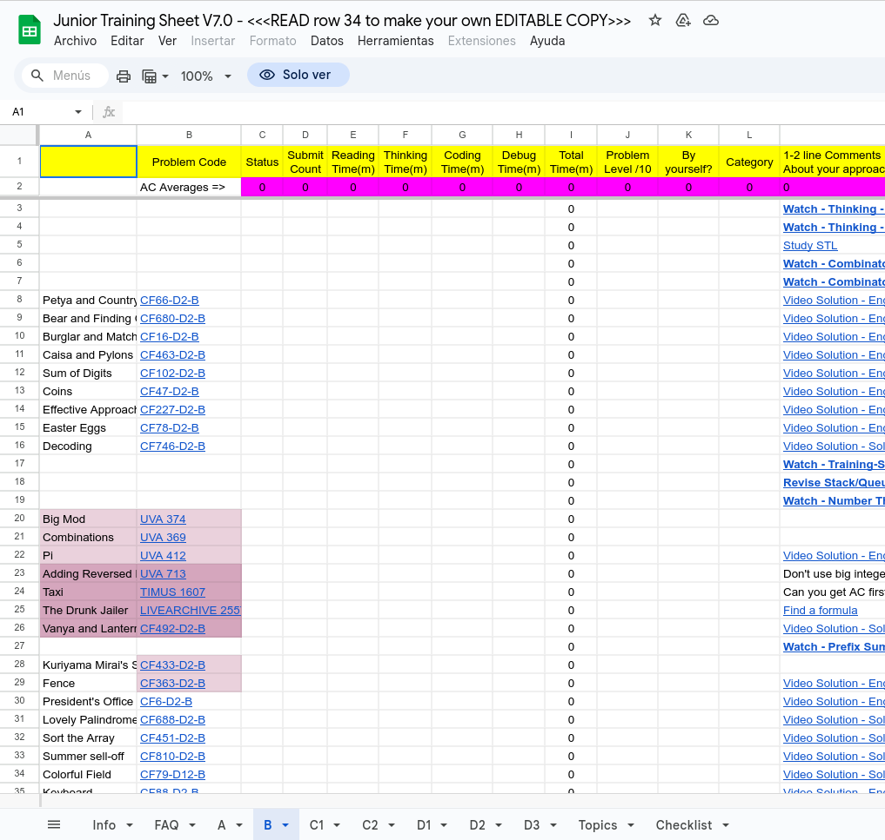
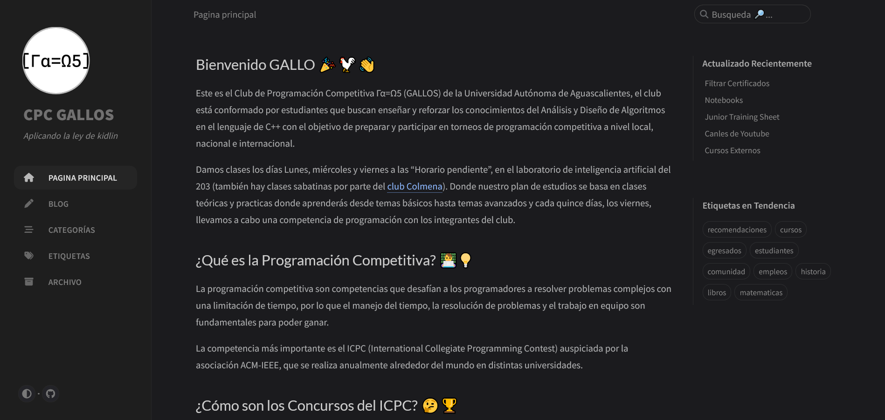

<!-- _class: cover_e -->
<!-- _paginate: "" -->
<!-- _footer:  -->
<!-- _header:  -->

# <!-- fit -->  Presentacion de Cierre

Por Ariel Parra

## 10 Cosas que podemos hacer en vacaciones

## 1. Prepararse para el ICPC

<!-- _class: cols-3 -->

> Reunir a un equipo de 3 y aprender coordinarse con las estrategias vistas en el curso.

> Entrenar haciendo multiples ejercicios de codeforces, contest y/o haciendo multiples ejercicios del Junior Training Sheet

> Leer uno o varios libros de programación competitiva! 

<!-- Todo esta en el blog -->

## 2. Aplicar para ser embajador 
<!-- _class: cols-3 -->

## 3. Ayudar en nuestro club Γα=Ω5
<!-- _class: cols-3 -->

> Ayudando con las presentaciones (Marp), clases, eventos, o cualquier cosa que se ocupe

> Ayudando con la difución, siendo comunity manager, creando y dando ideas para publicaciones y dandole like a nuestras publicaciones

> Ayudando con los blogs, ya sea en problemas de sintaxis, nuevas ideas de post, etc.

## 4. Aprender más lenguajes de programación

>Tambien recomiendo aprender a usar Markdown! 

## 5. Aprender nuevos paradigmas

## 6. Aprender frameworks y librerias 

---

<!-- _class: cols-3 -->

## 7. Hacer certificados y crear tu curriculum vitae (CV)/ Resume 

<!-- _class: cols-3 -->

## 8. Aprender Linux y Servidores
<!-- _class: cols-3 -->

## 9. Leer todos los blogs de cpc-gallos.github.io
<!-- _class: cols-2 bq-red -->

> Esto no es un simulacro
>
> Porfavor revisen todos los post de nuestra página :
[cpc-gallos.github.io](https://cpc-gallos.github.io/)

## 10. Descansar y ser felices!

