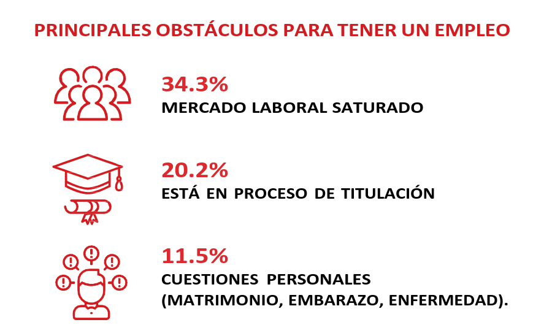
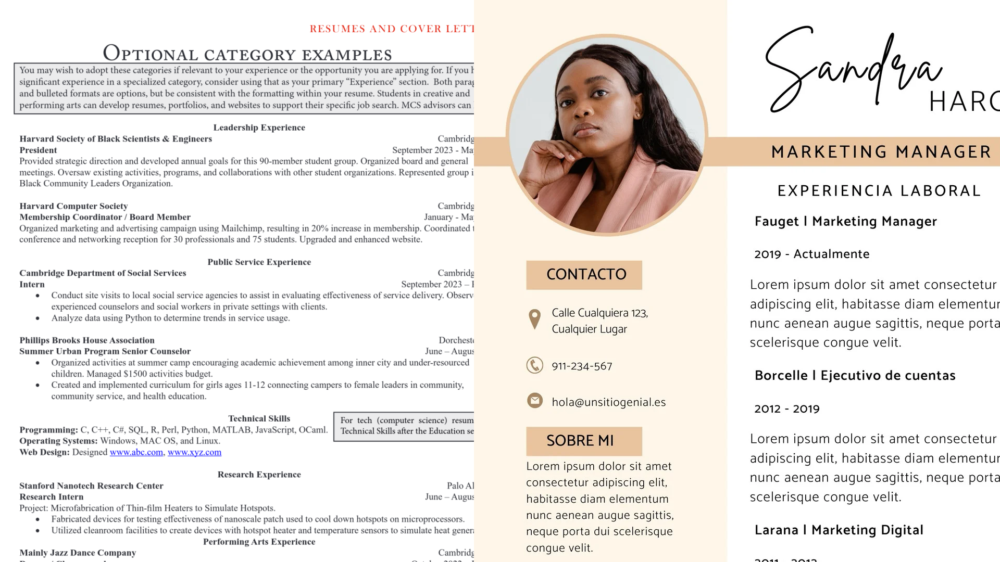
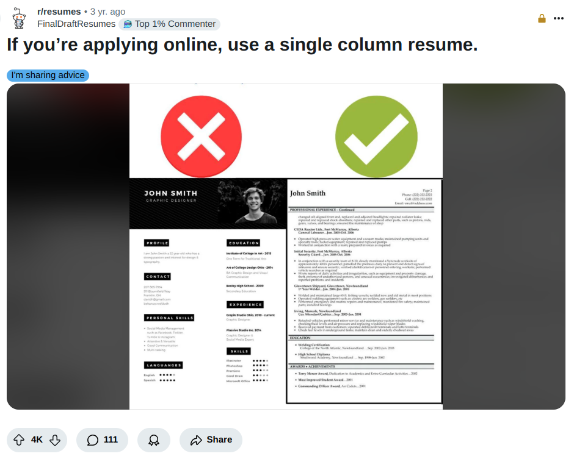
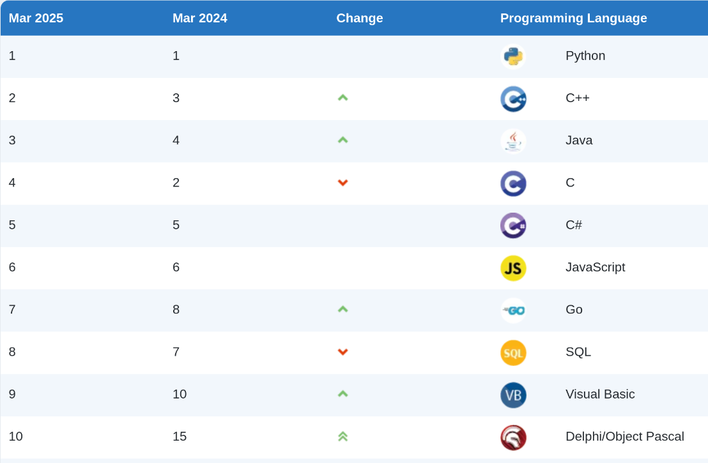
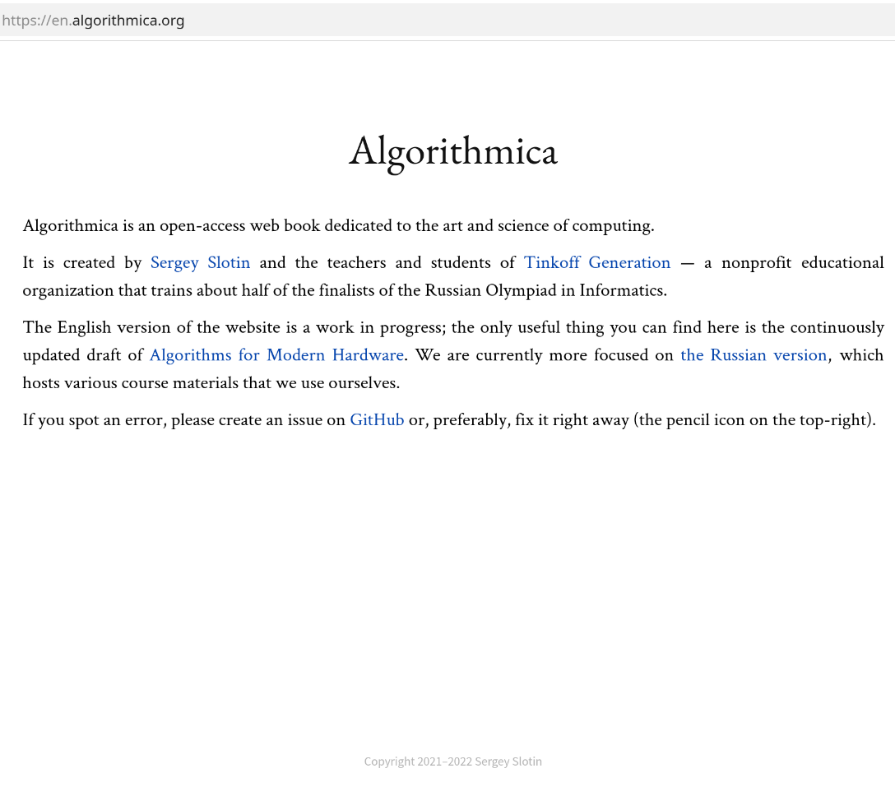

<!-- _class: cover_e -->
<!-- _paginate: "" -->
<!-- _footer:  -->
<!-- _header:  -->

# <!-- fit -->  Entrevistas Técnicas de Trabajo


Por Ariel Parra


<!-- 
Dejar de Tarea, Crear LinkedIn y GitHub

Mostrar CVs
Mostrar Readmes de GitHub
Mostrar Oferta de Trabajo en Amazon, requisitos
 -->

## Introducción 

<style>
section {
    font-size: 22px;
}
</style>

Al menos en nuestro estado, cada año se gradúan cientos de estudiantes en áreas de tecnología como informática, sistemas, computación inteligente e ingeniería de software, provenientes de múltiples universidades. El problema surge al analizar la oferta y la demanda a nivel nacional e internacional. El propósito de este taller es proporcionar las herramientas y habilidades necesarias para conseguir un empleo en el área STEM.


Fuente: ENCUESTA NACIONAL DE EGRESADOS 2023 UVM

## Tipos de empresas a las cuales aplicar

- Empresas **chicas** (Locales): Negocios con una infraestructura de TI básica o inexistente, como escuelas, pequeños comercios, restaurantes y startups locales.
- Empresas **Medianas** (Nacional o internacional): Softtek, C3AI, Inegi, Sensata Tech, Kuona, Epam, Wizeline.
- Empresas **Grandes** (Internacionales): Tiktok, Huawei, Intel, Dell, HP, Uber, Nissan, Cisco, IBM, BBVA.

- Empresas **Big Tech**:  

    - **FAANG**: Facebook, Apple, Amazon, Netflix y Google.  
    - **Big Five**: Alphabet, Apple, Amazon, Meta y Microsoft.  
    - **Magnificent Seven**: Alphabet, Apple, Amazon, Meta, Microsoft, Nvidia y Tesla.  


<!-- Las Empresas Chicas nunca hacen entrevista técnica, las medianas pueden o no hacer, y las grandes casi siempre hacen,-->

## Etapas de una Entrevista  

1. **Desarrollo Profesional:** Adquirir habilidades y experiencias relevantes.  
2. **Networking:** Conectar con profesionales y explorar oportunidades.  
3. **Aplicación:** Enviar CV o résumé a empresas de interés.  
4. **Entrevista Preliminar:** Primera toma de contacto, generalmente por teléfono o videollamada.  
   - **Situational Interview:** Evaluación basada en la resolución de escenarios hipotéticos.  
   - **Behavioral Interview:** Preguntas enfocadas en experiencias pasadas y habilidades interpersonales.  
5. **Entrevista Técnica o de Habilidades:** Evaluación de conocimientos específicos y resolución de problemas.  
6. **Entrevista Presencial:** Una o varias entrevistas en las oficinas de la empresa.  

## Soft Skills

Las habilidades blandas son aquellas que reflejan cómo te relacionas, trabajas e interactúas con otras personas. Son fundamentalmente habilidades interpersonales que facilitan una comunicación y colaboración efectiva.
- Resolución de problemas
- Comunicación
- Adaptabilidad
- Gestión del tiempo
- Manejo del estrés
- Ética de trabajo
- Liderazgo
- Escucha activa


## Hard Skills

Las habilidades duras se adquieren a través de la educación y/o la experiencia. Son conocimientos técnicos específicos que pueden ser evaluados mediante títulos, diplomas o certificados.
- Velocidad de tecleo y/o uso de una distribución americana de teclado
- Conocimiento de idiomas (por ejemplo, inglés, alemán, francés, etc.)
- Dominio de la sintaxis de varios lenguajes de programación (Python, Java, C++, etc.)
- Conocimiento de DSA.
<!-- DSA = Data Structures and Algorithms -->


## Acreditaciones y Reconocimientos (Credentials)  


<!-- _class: cols-2 -->

<div class=ldiv>

Existen diversas formas de validar y demostrar conocimientos o habilidades adquiridas. A continuación, se describen las principales diferencias entre insignias, certificados y certificaciones:  

- **Insignias (Badges):** Son reconocimientos por completar cursos breves y específicos. Suelen ser de forma circular o cuadrada, a diferencia de los certificados, que tienen una presentación rectangular. Las insignias se distribuyen a través de plataformas como Credly.  

- **Certificados (Certificates):** Son diplomas, constancias o reconocimientos otorgados por completar un curso, bootcamp, proyecto, examen sin supervisión, entre otros. Aunque valiosos, no cuentan con la validación  de las certificaciones.  
</div>

<div class=rdiv>


</div>

---

<!-- _class: cols-2 -->

<div class=rdiv>

- **Eventos Presenciales:** Incluyen bootcamps, hackatones, concursos, conferencias y otras actividades que contribuyen al desarrollo profesional.  

- **Certificaciones (Certifications):** A menudo confundidas con los certificados, su principal diferencia radica en el proceso de validación. Las certificaciones generalmente requieren un examen supervisado (proctored) a través de proveedores como Pearson VUE o PSI. Este proceso suele implicar un costo asociado a un voucher, lo que les otorga mayor peso y validez en el ámbito laboral.  

</div>

<div class=ldiv>


</div>

<!-- La certificación de TOEFL en la UAA cuesta $970, pero requieren 20 aspirantes para hacerlo  -->

## Ser embajador (ambassador)

<!-- _class: cols-3 -->

<div class=ldiv>


</div>

<div class=mdiv>


</div>

<div class=rdiv>


</div>

<!-- Un embajador es una persona que representa, habla por o anuncia a una organización, grupo de personas, actividad o marca en particular. 
Estos reconocimientos son muy útiles si quieres aplicar para un trabajo en dicha empresa o empresas relacionadas,
 ya que aparte de poder tener una red de socios expertos en los temas de interés, también te destaca como una persona interesada en esa empresa y tecnologías -->

## Networking y Marca Personal


El **networking** es la habilidad de crear y mantener redes de contactos profesionales que fomentan oportunidades y crecimiento en tu carrera laboral. Este proceso puede iniciarse en etapas educativas, como el bachillerato o la universidad, y debe considerarse una actividad continua. 

<!-- La universidad no siempre es la mejor opción para adquirir conocimientos, pero es una excelente oportunidad para hacer networking y establecer conexiones valiosas. En EE.UU., muchas empresas no requieren un título universitario, pero al menos en México sigue siendo un requisito común contar con un título y cédula profesional. -->

Para la **marca personal** debes tener una presencia activa en línea; Mantener perfiles actualizados en plataformas como LinkedIn, GitHub, y un **portafolio web**. 

#### **Eventos:**  
- **Ferias de empleo y Virtual Career Fairs**: Conectar directamente con reclutadores. Ejemplos: Feria de empleo de la UAA y la IBM Z Global Virtual Career Fair.
- **Meetups y conferencias**: Compartir conocimientos y experiencias con profesionales del sector. Ejemplos: TalentLand, Código Fest, Google Cloud Next, Google I/O, Microsoft Build, etc. 
- **Hackatones y competencias**: Demostrar habilidades técnicas y de colaboración. Ejemplos: [ICPC](https://icpc.global/), [Meta HackerCup](https://www.facebook.com/codingcompetitions/hacker-cup), [Talent Hackathon](https://hackathon.talent-network.org/), [NASA App Development Challenge](https://www.nasa.gov/learning-resources/app-development-challenge/), [FINANHACK](https://solutions.lseg.com/FINANHACK2024), etc.

---


#### **Plataformas Digitales:**  
- **LinkedIn e Indeed**: Plataformas para búsqueda de empleo y networking.  
- **Job Shadowing & Information Interviews**: Contactar profesionales para conocer más sobre sus roles.  


> Contar con una **carta de recomendación** de profesores, empleados, supervisores, etc. Puede ayudar a que los reclutadores consideren tu solicitud con mayor interés.  

<!-- Si estás interesado en trabajar en una empresa específica, intenta conectar con personas que ya trabajan allí o con ex empleados que puedan compartir su experiencia y ofrecerte consejos sobre el proceso de selección.
También si estan urgidos de trabajo hay muchas oportunidades como computrabajo.com, la feria de empleo de la UAA -->

## Currículum Vitae (CV / Hoja de vida) y Résumé


| **Aspecto**        | **Résumé (Resume)** | **Currículum Vitae (CV)** |
|--------------------|---------------------|---------------------------|
| **Objetivo**       | Muestra cómo tus experiencias y habilidades te califican para el trabajo deseado. | Muestra tus logros académicos y calificaciones en investigación. |
| **Extensión**      | Límite estricto de 2 páginas Maximo (1 hoja de papel). | 2-3 páginas para un estudiante de posgrado; se alarga con la carrera. |
| **Secciones típicas** | - Nombre e información de contacto  <br> - Educación  <br> - Experiencia laboral  <br> - Habilidades | - Nombre e información de contacto  <br> - Educación  <br> - Experiencia en investigación  <br> - Objetivos profesionales/intereses de investigación  <br> - Publicaciones y presentaciones  <br> - Premios y becas  <br> - Sociedades profesionales  <br> - Experiencia docente  <br> - Referencias |

<!-- Especial para trabajos de investigación, académicos y posgrados -->

## Formatos

<!-- _class: bq-red  -->

<div style="display: flex; justify-content: space-between;">

<div style="width: 45%;">

#### Formato Americano
- [Harvard](https://careerservices.fas.harvard.edu/resources/create-a-strong-resume/)
- [Jake's Resume](https://www.overleaf.com/latex/templates/jakes-resume-anonymous/cstpnrbkhndn)
- [70+ ATS Resume Template](https://www.overleaf.com/latex/templates/70-plus-ats-rating-resume-template/ssprfsctyddz)

</div>

<div style="width: 45%;">

#### Formato Europeo
- [europass](https://europass.europa.eu/en/create-europass-cv)
- [simple cv](https://www.overleaf.com/latex/templates/simple-hipster-cv/cnpkkjdkyhhw)

</div>

</div>



> Para revisar tu CV y/o resume recomiendo visitar la [el subreddit r/resumes](https://www.reddit.com/r/resumes/) y el Simulador de Applicant Tracking System (ATS)[resumatic.rezi.ai](https://resumatic.rezi.ai/)

<!--
El formato Europeo (conocido como moderno o simple), en palabras de un reclutador "hace que tu CV Respire y no se vea aglomerado". Sea cual sea el formato, tu CV tiene que tener algo único y especial que lo destaque de los demás.
Al final del dia no es una ciencia exacta y dependerá del empleador, nunca es bueno retacar tu cv, si tienes varias certificaciones piensa cuales se alinean con el puesto o empresa a la que aplicas, pero siempre hay que recordar: " ¿Que diferencia un villano de un súper villano?". 

-->

---



<!-- Este es el post con mas upvotes (likes) del subredit de resumes -->

## Situational Interview y Behavioral Interview
En una **Situational Interview**, se describe cómo actuarías en una situación hipotética, mientras que en una **Behavioral Interview**, se te pide que compartas experiencias pasadas para evaluar cómo has manejado situaciones específicas.

- **"Cuéntame un poco sobre ti..."** → Experiencia relevante. Habilidades alineadas con el puesto. Motivación profesional.
- **"¿Por qué quieres trabajar aquí?"** → Cultura y valores alineados. Aporte con tus habilidades. Interés.
- **"¿Por qué deberíamos contratarte?"** → Diferenciador clave. Experiencia y logros. Impacto en el puesto.
- **"¿Por qué estás dejando tu trabajo actual?"** → Crecimiento profesional. Nuevos desafíos.
- **"¿Dónde te ves en 5 años?"** → Desarrollo profesional. Crecimiento en la empresa. Objetivos realistas.
- **"¿Qué haces fuera del trabajo?"** → Actividades con habilidades transferibles. Intereses alineados.
- **"¿Cuáles son tus fortalezas y debilidades?"** → Fortalezas con impacto. Debilidades en mejora. Honestidad estratégica.

<!-- 
¿Por qué quieres trabajar aquí?, ¿Qué puedes aportar a nuestro equipo?
Quiero trabajar aquí porque valoro el aprendizaje constante y la colaboración. Me emociona la idea de aprender de mis compañeros y, al mismo tiempo, compartir mi experiencia para contribuir al equipo.
-->

## Método STAR
- **Situation** (Situación): Contexto del evento.
- **Task** (Tarea): Responsabilidad en la situación.
- **Action** (Acción): Pasos tomados para abordar la situación.
- **Result** (Resultado): Consecuencias de las acciones tomadas.

<!--  
**Ejemplo STAR:  ICPC **  
- **Situation (Situación):** Competí en el ICPC, un concurso internacional de programación donde los equipos tienen tiempo limitado para resolver problemas algorítmicos complejos.  
- **Task (Tarea):** Como líder de un equipo de tres, mi rol era optimizar estrategias, coordinar la asignación de problemas y garantizar una comunicación eficiente bajo presión.  
- **Action (Acción):** Implementamos un enfoque estructurado: priorizamos problemas por dificultad, dividimos tareas según fortalezas y mantuvimos una comunicación constante para evitar bloqueos. En momentos de alta presión, ajustamos nuestra estrategia rápidamente y nos apoyamos mutuamente para mantener el ritmo.  
- **Result (Resultado):** Mejoramos nuestro rendimiento en cada competencia, resolviendo problemas con mayor eficiencia. Esta experiencia me fortaleció en trabajo en equipo, toma de decisiones bajo presión y gestión del estrés en entornos exigentes.  

-->


## Technical Interview (Empresas Medianas y Grandes)

<!--
https://leetcode.com/problems/fizz-buzz/ 
Es una pregunta algo esteriotipica de las entrevistas de trabajo
-->

Una **Technical Interview** es un tipo de entrevista utilizada para evaluar las habilidades técnicas y conocimientos del candidato. Generalmente incluyen 1 o 2 problemas algorítmicos, con una duración entre 30 - 60 min  por problema. También suelen realizarse en inglés y pueden llevarse a cabo de manera presencial o remota. En el caso de entrevistas en línea, es común el uso de proctoring.
<!--
virtuales donde hacen llamada por zoom, teams, skype, o su propio software (Dato curioso skype desaparecera el 5 de mayo de 2025).
 
Proctor: bloqueo de la página, no puedes salirte o si puedes, se te descalifica, revisan tu cuarto, graban tu pantalla, cámara y micrófono.
-->
#### Objetivos
- **Verificación de habilidades**: Confirmar que se posea las habilidades técnicas mencionadas en el CV.
- **Habilidad para resolver problemas**: Evaluar el enfoque para resolver problemas complejos y la capacidad de proporcionar soluciones prácticas.
- **Compatibilidad con el equipo**: Determinar si el estilo de trabajo y conocimientos del candidato se alinean con la metodología de la empresa.
- **Potencial de crecimiento**: Medir la capacidad de aprendizaje y adaptación a nuevas tecnologías y desafíos.

> Temas Frecuentes en Programación:  Pilares OOP, DSA, Problem Solving, sistemas y arquitecturas de software.

### Criterios de Evaluación de una Entrevista
- **Habilidades analíticas**:
  - ¿Qué tan óptima fue tu solución y en cuánto tiempo llegaste a una solución?
  - ¿Estructuraste bien el problema y consideraste los trade-offs de distintas decisiones?

- **Habilidades de codificación**:
  - ¿Pudiste traducir tu algoritmo en código razonable?
  - ¿Consideraste posibles errores y usaste buenas prácticas de estilo?

- **Conocimientos técnicos y fundamentos de informática**:
  - ¿Tienes una sólida base en ciencias de la computación y las tecnologías relevantes?

- **Experiencia**:
  - ¿Has trabajado en proyectos desafiantes e interesantes?
  - ¿Has demostrado iniciativa y determinación?


### Estrategia para Resolver Problemas en una Technical Interview
1. **Comprender el problema**: Preguntar clarificaciones si es necesario.
2. **Definir el enfoque (Aproach)**: Explicar la estrategia antes de escribir código.
3. **Escribir pseudocódigo**: Planificar la solución antes de codificarla.
4. **Implementar la solución**: Escribir código limpio y estructurado.
5. **Optimizar y verificar**: Revisar errores, optimizar y mejorar la solución.
<!-- Mucha gente siempre se complica eligiendo un lenguaje para programar ya sea python, C++, Java, etc. pero hay que recordar que los lenguajes no son la programacion. Es esta tambien la razon por la cual muchos reclutadores piden PSEUDOCODIGO antes que el codigo en un lenguaje
 -->


### Pregunta Final

> Siempre es recomendable hacer una pregunta al empleador para demostrar interés y compromiso.

- "¿Cómo es un día normal en la empresa?"
- "¿Cómo es el proceso de evaluación del desempeño en la empresa?"
- "¿Hay oportunidades de crecimiento y desarrollo profesional dentro de la empresa?"
- "¿Qué cualidades tienen los empleados en esta organización?"
- "¿Cuál es la cultura del equipo y cómo se fomenta la colaboración?"

## DSA y Algoritmia

<script type="module">
import mermaid from 'https://cdn.jsdelivr.net/npm/mermaid@10/dist/mermaid.esm.min.mjs';
mermaid.initialize({ startOnLoad: true });

window.addEventListener('vscode.markdown.updateContent', function() { mermaid.init() });
</script>

<pre class="mermaid" style="text-align: center;">
graph LR;
    A[PROBLEMA: Datos.]
    B[SOLUCIÓN: Resultado esperado.]
    A --> B
</pre>

<!-- 
Un algoritmo es una secuencia de pasos para resolver un problema.
La algoritmia es la ciencia que estudia a los algoritmos
-->

---

<!-- map y set de c++ se implementan con un Árbol balanceado (Red-Black Tree), pero el dict y set de python usan un hash table, lo que lo asemeja mas a un unordered_map/set de c++. Pero en uso son similares  -->


<!--
preguntar limite de tipos de datos primitivos en c/c++ 
int 10^9, y long long 10^18 (64 bits) 
int de python tienen precisión arbitraria
-->

## Clases de la complejidad


<!-- 
P (Polynomial Time): Problemas solubles en P con una máquina determinista.
NP (Nondeterministic Polynomial Time): Problemas cuya solución se puede verificar en tiempo polinómico. 
  Ejemplo: Traveling Salesman Problem (TSP) (verificar una ruta es rápida).
NP-completo (NPC): Problemas en NP tan difíciles como cualquier otro en NP.
    Ejemplo: SAT (Boolean Satisfiability Problem).
NP-hard: Problemas al menos tan difíciles como los NP-completos, pero no necesariamente en NP.
    Ejemplo: TSP en su versión de optimización (encontrar la ruta más corta).
 -->

## Complejidad de Algoritmos: Big O 
<!--
BigO es un termino usado en el campo de las matematicas y en la industria de la programacion
-->


La **notación Big O** (O Grande) se usa en la programación para analizar la eficiencia de los algoritmos, midiendo cómo crece el tiempo de ejecución (runtime) o el uso de memoria en función del tamaño de la entrada ($n$).

**Definición formal:**  
$T(n)$ es $O(g(n))$ si existen constantes $c$ y $n_0$ tales que para todo $n \geq n_0$:  
$$
T(n) \leq c \cdot g(n)
$$  

**En otras palabras:** Big O define un límite superior para el crecimiento de la función $T(n)$, asegurando que **en el peor caso**, no crece más rápido que $g(n)$.  
 


## Tabla de funciones Polinomiales

**Notación en Big O**    | **Nombre de la función**
------------|------------------------------------------------
**O(1)** 	    | Constante
**O(log n)** 	| Logarítmica
**O(n)**        | Lineal 
**O(n · log n)**| Lineal logarítmica o casi-lineal
**O(n\^2)** 	| Cuadrática
**O(n^k)** 	    | Potencial (`k` siendo constante y `k` > 1)
**O(k^n)**      | Exponencial (`k` usualmente siendo `2` y `n` > 1)
**O(n!)**       | Factorial

---

<style scoped>
.green {border: 1px solid #286500;color: black;background-color: #53d000;}
.yellow-green {border: 1px solid #286500;color: black;background-color: #C8EA00;}
.yellow {border: 1px solid #6f6e00;color: black;background-color: yellow;}
.orange {border: 1px solid #b20000;color: black;background-color: #FFC543;}
.red {border: 1px solid #b20000;color: black;background-color: #ff8989;}
</style>
<div>
    <table>
    <tbody>
        <tr>
        <td><code class="red">Horrible</code></td>
        <td><code class="orange">Bad</code></td>
        <td><code class="yellow">Fair</code></td>
        <td><code class="yellow-green">Good</code></td>
        <td><code class="green">Excellent</code></td>
        </tr>
    </tbody>
    </table> 
</div>

<svg id="chart" width="800" height="600" xmlns="http://www.w3.org/2000/svg" style="font-size: 18px;" class="center">
<!-- horrible region -->
<path d="M50 450 L 50 0 L 800 0 L 800 450 Z" fill="#ff8989"></path>
<!-- bad region -->
<path d="M50 450 L 800 0 L 800 450 Z" fill="#FFC543"></path>
<!-- fair region -->
<path d="M50 450 L 800 450 L 800 330 Z" fill="yellow"></path>
<!-- good region -->
<path d="M50 450 L 800 450 L 800 410 Z" fill="#C8EA00"></path>
<!-- excellent region -->
<path d="M50 450 L 800 450 L 800 440 Z" fill="#53d000"></path>
<!-- axes -->
<path d="M50 0 L 50 450 L 800 450" fill="transparent" stroke="black" stroke-width="2"></path>
<path d="M50 448 L 800 448" fill="transparent" stroke="black" stroke-width="2"></path>
<text x="700" y="438" fill="black">O(log n), O(1)</text>
<path d="M50 450 L 800 400" fill="transparent" stroke="black" stroke-width="2"></path>
<text x="760" y="390" fill="black">O(n)</text>
<path d="M50 450 Q 400 350, 800 150" fill="transparent" stroke="black" stroke-width="2"></path>
<text x="630" y="190" fill="black">O(n log n)</text>
<path d="M50 450 Q 180 380, 250 0" fill="transparent" stroke="black" stroke-width="2"></path>
<text x="260" y="30" fill="black">O(n^2)</text>
<path d="M50 450 C 100 430, 120 350, 120 0" fill="transparent" stroke="black" stroke-width="2"></path>
<text x="125" y="20" fill="black">­­­­­­឵឵O(2^n)</text>
<path d="M50 450 C 80 450, 80 350, 80 0" fill="transparent" stroke="black" stroke-width="2"></path>
<text x="80" y="20" fill="black">O(n!)</text>
<text x="0" y="0" transform="translate(30 230) rotate(-90)" style="dominant-baseline: middle; text-anchor: middle; font-size:20px; color: #555; font-size:20px; color: #555; font-style: italic;" fill="black">Operations</text>
<text x="0" y="0" transform="translate(420 470)" style="dominant-baseline: middle; text-anchor: middle; font-size:20px; color: #555; font-style: italic;" fill="black">Elements</text>
</svg>

## Tabla de notaciones 

| **Notación** | **Tipo de cota**             | **Descripción**                                      |
|--------------|------------------------------|------------------------------------------------------|
| **O (Big O)**| Cota asintótica superior (≥)      | Describe el **peor de los casos** de un algoritmo.        |
| **o (small o)**| Límite superior estricto (>)    | Una función crece más lentamente que otra función . |
| **Ω (Big Omega)**| Cota asintótica inferior (≤)     | Describe el **mejor de los casos** de un algoritmo.       |
| **ω (small omega)**| Límite inferior estricto (<)   | Una función crece más rápidamente que otra función. |
| **Θ (Big Theta)**| Cota asintótica exacta (==)      | Describe el **caso promedio** de un algoritmo. |

<!--Asíntota: Una curva que se acerca indefinidamente a una recta o a otra curva sin llegar nunca a encontrarse.  -->

## Tipos de Problemas y Paradigmas

> Depende del autor o fuente existen desde 16 a 37 tipos de problemas, pero estos caben en 7 grupos

- **Adhoc (math, simulation, strings) - O(n) a O(n²)**  
  Problemas que no requieren un algoritmo específico o técnica avanzada, sino creatividad y pensamiento lógico. Suelen involucrar simulaciones, manipulación de cadenas o aritmética básica.  
<!--
Muchos problemas matematicos son implementaciones de sumatorias, (suma gaussiana) y 
En pizarron: sum=(n * (n + 1)) / 2)
Complejidade de O(1)
  -->
- **Range Queries (Prefix Sum) - O(1) a O(log n) por consulta**  
  Paradigma que permite responder eficientemente preguntas sobre intervalos en estructuras de datos como arreglos o árboles. Con prefix sum, las consultas son O(1), mientras que estructuras como Fenwick Tree o Segment Tree permiten actualizaciones y consultas en O(log n).  
<!-- 
for (int i = 0; i < n; ++i) { // O(n) pero consulta en O(1)
    ps[i] = ps[i - 1] + arr[i]; 
}
-->
- **Divide and Conquer (Binary Search, Two Pointers) - O(log n) a O(n log n)**  
  Técnica en la que un problema se divide en subproblemas más pequeños y se resuelve combinando sus soluciones. Ejemplos comunes incluyen búsqueda binaria (O(log n)) y el uso de dos punteros (O(n)). Algoritmos como Merge Sort tienen O(n log n).  
  > **Best Conceivable Runtime** (BCR): ninguna solución puede ser más rápida que este límite.
<!-- 
BCR es un termino usado en el famoso libro Cracking the Coding Interview por Gayle Laakmann.
-->

---

- **Greedy - O(n) a O(n log n)**  
  Estrategia en la que se toman decisiones locales óptimas en cada paso con la esperanza de obtener una solución global óptima. Algoritmos como Huffman coding o problemas de mochila (Knapsack) pueden requerir O(n log n) si involucran ordenación.  

- **Dynamic Programming - O(n²) a O(2ⁿ)**  
  Técnica que descompone un problema en subproblemas solapados, resolviéndolos una sola vez y almacenando sus resultados. La complejidad varía mucho según el problema y la optimización usada. Por ejemplo, LCS es O(n²), pero problemas como subset sum sin memoization pueden llegar a O(2ⁿ).  

- **Complete Search (Backtracking, Brute Force) - O(n!) a O(2ⁿ)**  
  Método que explora todas las soluciones posibles de un problema. La fuerza bruta pura puede ser O(n!) en problemas de permutaciones, mientras que backtracking con poda puede mejorar el rendimiento en algunos casos.  

- **Grafos (Árboles, Traversal) - O(|V|+|E|) a O(V³)**  
  Paradigma para resolver problemas con estructuras de grafos. Algoritmos de recorrido como BFS y DFS tienen complejidad O(V + E). Algoritmos como Floyd-Warshall para caminos mínimos tienen O(V³), mientras que Dijkstra con heap tiene O((V + E) log V).  

---


<!--
ADHOC: Misc 12.1 + sim 2.2 + adv estruc 7.1 + basic dsa 16.9 = 38.3
GRAPH: back 7.1 + BFS 8.8 + DFS 10 + heap 4.8 + graph 2.5 = 33.2
DIV N CONQ: two pointer 12 + binary search 5.6 = 17.6 
DP: 10.8
-->

## Algoritmos Adhoc
<!-- 

PROGRAMA: Cálculo del Factorial de un Número en Pseudo
Inicio
    Escribir "Ingrese un número:"
    Leer n
    factorial := 1
    Para i desde 1 hasta n hacer
        factorial := factorial * i
    Fin Para

    Escribir "El factorial de ", n, " es: ", factorial
Fin

 -->
- [Leetcode - Check If N and Its Double Exist](https://leetcode.com/problems/check-if-n-and-its-double-exist/)  
- [Leetcode - Remove Linked List Elements](https://leetcode.com/problems/remove-linked-list-elements/)  
- [Leetcode - Rectangle Overlap](https://leetcode.com/problems/rectangle-overlap/)  
- [Leetcode - Can Place Flowers](https://leetcode.com/problems/can-place-flowers/)  
- [Leetcode - Remove One Element to Make the Array Strictly Increasing](https://leetcode.com/problems/remove-one-element-to-make-the-array-strictly-increasing/)  

#### Algoritmos de Strings

- [**Leetcode - ransom Note**](https://leetcode.com/problems/ransom-note/)
- [Leetcode - Rotate String](https://leetcode.com/problems/rotate-string/)  
- [Leetcode - Check If One String Swap Can Make Strings Equal](https://leetcode.com/problems/check-if-one-string-swap-can-make-strings-equal/)  
- [Leetcode - Number of Valid Words in a Sentence](https://leetcode.com/problems/number-of-valid-words-in-a-sentence/)  
- [Leetcode - Valid Anagram](https://leetcode.com/problems/valid-anagram/)  

<!-- Estos son ejemplos pedidos en C3.AI -->

## Algoritmos Divide & Conquer

- [Leetcode - Binary Search](https://leetcode.com/problems/binary-search/description/)
- [Leetcode - Find the Duplicate Number](https://leetcode.com/problems/find-the-duplicate-number/description/)
- [Leetcode - Kth Smallest Element in a Sorted Matrix](https://leetcode.com/problems/kth-smallest-element-in-a-sorted-matrix/description/)

```c++
int binarySearch(int arr[], int low, int high, int x) {
    while (low <= high) {
        int mid = low + (high - low) / 2;
        
        if (arr[mid] == x) return mid;
        if (arr[mid] < x) low = mid + 1;
        else high = mid - 1;
    }
    return -1;
}// O(log n)
```

## Algoritmos Greedy

- [Leetcode - Best Time to Buy and Sell Stock](https://leetcode.com/problems/best-time-to-buy-and-sell-stock/description/)
- [Leetcode - Jump Game](https://leetcode.com/problems/jump-game/description/)
- [Leetcode - Task Scheduler](https://leetcode.com/problems/task-scheduler/description/)

```c++
bool canJump(vector<int>& nums) {
  int size = nums.size() - 1;//O(1)
  int goal = size;
  for (int i = size; i >= 0; --i)//O(n)
    if (i + nums[i] >= goal) goal = i;
  return (goal == 0); 
}//O(n)
```

<!-- 
1. Conjunto de candidatos → Índices del arreglo nums.
2. Solución parcial → Índices alcanzables desde la posición inicial.
3. Función de selección → El índice más cercano al final que se puede alcanzar.
4. Función de factibilidad → Verificar si i + nums[i] >= goal para actualizar la meta.
5. Criterio de solución → goal == 0, indicando que podemos llegar al último índice.
6. Función objetivo → Determinar si se puede alcanzar el último índice con mínima iteración. -->

## Algoritmos de Grafos

- [Leetcode - Minimum Depth of Binary Tree](https://leetcode.com/problems/minimum-depth-of-binary-tree/description/)
- [Leetcode - Diameter of Binary Tree](https://leetcode.com/problems/diameter-of-binary-tree/description/)
- [Leetcode - Number of Islands](https://leetcode.com/problems/number-of-islands/description/)

#### Depth-first search
<!-- Los graph traversals o recorrido de grafos suelen ser de las preguntas mas comunes, pero no se preocupen la mayoria de reclutadores no ha programado uno desde la universidad, aparte de que lo que buscan es tu **aproach** o acercamiento al problema -->

```c++
void dfs(int s, vector<vector<int>>& adj, vector<bool>& visited) {
    static int depth = 0; 
    if (visited[s]) return; // Si el nodo ya fue visitado
    visited[s] = true;
    cout << "Node: " << s << ", depth: " << depth << endl;
    ++depth;
    for (auto u : adj[s]) dfs(u, adj, visited); // se recorren todos los nodos vecinos
    --depth;
}// O(V + E)
```
<!--
En Depth-First Search
Si la profundidad es muy grande el heap y el stack pueden chocar y provocar stack overflow.
stack: almacena variables locales
heap: memoria dinámica para que la asigne el programador -->

##  Breadth-first search
```c++
void bfs(int start, const vector<vector<int>>& adj, vector<bool>& visited) {
  queue<int> q; // nodos por explorar
  int distance[n]; //distancia de cada nodo desde el nodo inicial
  visited[start] = true;
  distance[start] = 0;
  q.push(start); // nodo inicial a la cola
  while (!q.empty()) { //// Mientras haya nodos en la cola
  int s = q.front(); q.pop(); // primer nodo de la cola
    for (auto u : adj[s]) { // se recorren todos los nodos vecinos
      if (visited[u]) continue;
      visited[u] = true;
      distance[u] = distance[s]+1;
      q.push(u); // se añade el nodo vecino 
    }
  }
}//O(V + E)
```
<!-- x es el inicio  -->

> Recomiendo visualizar estos algoritmos en: https://algorithm-visualizer.org/brute-force/breadth-first-search

## Algoritmos de Dynamic Programming
<!-- Similar a greedy pero aqui el resultado actual depende del resultado anterior y se utiliza la técnica de memoization y/o tabulación para guardar los resultados.
Cuando haya problemas que tengan que ver con numeros primos, mayormente seran DP debido a que utiliaras el algoritmo de la criba de eratostenes (sieve)  -->
- [Leetcode - Count Primes](https://leetcode.com/problems/count-primes/)  
- [Leetcode - Range Sum Query - Immutable](https://leetcode.com/problems/range-sum-query-immutable/description/)
- [Leetcode- House Robber](https://leetcode.com/problems/house-robber/description/)
```c++
int fibonacci(int n){                       //O(2^n)
    if(n<=1) return 1;                      //O(1)
    return fibonacci(n-1) + fibonacci(n-2); //O(2^n)
}
```
```c++
for (ull i = 2; i <= n; ++i)  // O(n)
  ans[i] = ans[i - 1] + ans[i - 2]; // O(n) en tiempo y espacio
``` 


## Plataformas de problemas de entrevistas

- [hash.to](https://hashto.net/Resources)
- [seanprashad.com](https://seanprashad.com/leetcode-patterns/)
- [cses.fi](https://cses.fi/problemset/)
- [leetcode](https://leetcode.com/studyplan/)
- [Hackerrank](https://www.hackerrank.com/dashboard)
- [bytebytego](https://bytebytego.com/exercises/coding-patterns)
- [techinterviewhandbook](https://www.techinterviewhandbook.org/grind75/)
- [algomonster](https://algo.monster/problems/stats)
- [algomap.io](https://algomap.io/)

<!-- Abrir handbook -->


## Plataformas para practicar Mock Interviews

- [interviewing.io](https://interviewing.io/)
- [Google Interview Prep](https://techdevguide.withgoogle.com/paths/interview/)
- [gainlo.co](http://www.gainlo.co/#!/)
- [hellointerview.com](https://www.hellointerview.com/)
- [pramp.com](https://www.pramp.com/#/)


## Lenguajes de Programación populares

<!-- _class: cols-2 -->


<div class=ldiv>


- Fuente: [Octoverse 2024](https://github.blog/wp-content/uploads/2024/10/GitHub-Octoverse-2024-top-programming-languages.png?w=1400)

</div>

<div class=rdiv>



- Fuente: https://www.tiobe.com/tiobe-index/

</div>

## Lecturas Recomendadas


<!-- _class: cols-3 -->

<div class=ldiv>


</div>

<div class=mdiv>


</div>

<div class=rdiv>




</div>

<!-- 
Algorithms design manual - Steven Skiena
Competitive Programming 4 - Steven Halim y Felix Halim
Cracking the Coding Interview - Gayle Laakmann McDowell
Coding Interview Patterns - Kamran Ahmed
Clean Code - Robert C. Martin
ALgoritmica - Sergey Slotin 

**Principles of Software Engineering:**

1.KISS (Keep It Simple, Stupid): código simple y fácil de entender, sin espagueti
2.DRY (Don’t Repeat Yourself): Evita la duplicación de código
3.YAGNI (You Aren’t Gonna Need It): Implementar solo lo necesario
4.TDA (Tell, Don’t Ask): los objetos auto responsables
5.SOLID: SRP (Single Responsibility Principle), OCP (Open/Closed Principle) a extension, LSP (Liskov Substitution Principle), ISP (Interface Segregation Principle), DIP (Dependency Inversion Principle)

**Pilares de POO:**
Abstracción: Permite omitir detalles que no son necesarios y mostrar solo lo relevante. 
Encapsulamiento: Permite controlar quién puede ver y utilizar los datos de un objeto. 
Herencia: Las clases secundarias heredan datos y comportamientos de la clase principal. 
Polimorfismo: Permite realizar una acción de múltiples o diferentes formas

https://www.tiobe.com/tiobe-index/

-->

## Referencias

- A. James Clark. (2022). *Interview Tips*. Recuperado de <https://eng.umd.edu/sites/clark.umd.edu/files/Interview%20Tips%20Handout.pdf>
- CPC-GALLOS. (2024). *Big O (Complejidad de ALgoritmos)*. Recuperado de <https://cpc-gallos.github.io/Presentations/2024/2_001-BigO.html>
- CPC-GALLOS. (2024). *Tipos de Problemas y Paradigmas*. Recuperado de <https://cpc-gallos.github.io/Presentations/2024/2_002-Tipos_Problemas_Paradigmas.html>
- Ernst, F. et all. (2000). *Teamwork in Programming*. Recuperado de <http://arantxa.ii.uam.es/~swerc/p6-ernst.pdf>
- Florida State University. (s.f.). *Preparing for Your Technical Interview*. Recuperado de <https://career.fsu.edu/sites/g/files/upcbnu746/files/Final%20Technical%20Interview%20Guide.pdf>
- Florida State University. *Career Guides*. Recuperado de <https://career.fsu.edu/resources/career-guides>

---

- Harvard. (2017). *RESUME/CV GUIDE*. Recuperado de   <https://content.sph.harvard.edu/wwwhsph/sites/36/2017/08/Resume-Guide-October-2017.pdf>
- Harvard. (s.f.). *CVs and Cover Letters*. Recuperado de  <https://hwpi.harvard.edu/files/ocs/files/gsas-cvs-and-cover-letters.pdf>
- Haykal, I. (2017). *Comunicación asertiva: cómo expresarse de manera clara*. Recuperado de <https://psicologiaymente.com/social/comunicacion-asertiva>
- Indeed. (2024). *Qué preguntas hacer en una entrevista de trabajo*. Recuperado de <https://mx.indeed.com/orientacion-profesional/entrevistas/que-preguntas-en-una-entrevista-de-trabajo>
- Laakmann, G. (s.f.).*Resources*. Recuperado de <https://www.crackingthecodinginterview.com/resources.html>
- Liu, .R. (s.f.). *Training ICPC Teams: A Technical Guide*. Recuperado de <https://www.cs.montana.edu/users/paxton/classes/ravensburg/materials/TrainingICPC.pdf>
- McLellan, C. (2025). *La cover letter perfecta: qué es y estructura*. Recuperado de <https://www.britishcouncil.es/blog/covering-letter-en-ingles>
- MIT. (s.f). *Using the STAR method for your next behavioral interview (worksheet included)*. Recuperado de <https://capd.mit.edu/resources/the-star-method-for-behavioral-interviews/>

---

- National Careers GOV UK. (s.f.). *The STAR method*. Recuperado de <https://nationalcareers.service.gov.uk/careers-advice/interview-advice/the-star-method>
- Pedro Enrique. (2024). *KISS, DRY, SOLID, YAGNI — A Simple Guide to Some Principles of Software Engineering and Clean Code*. Recuperado de <https://medium.com/@hlfdev/kiss-dry-solid-yagni-a-simple-guide-to-some-principles-of-software-engineering-and-clean-code-05e60233c79f>
- Santander Universidades. (2021). *Habilidades para currículum: cuáles son las más importantes y cómo destacarlas*. Recuperado de <https://www.santanderopenacademy.com/es/blog/habilidades-para-curriculum.html>
- University of Washington. (2014). *Interviewing*. Recuperado de <https://courses.cs.washington.edu/courses/cse403/14sp/lectures/lecture17-interviewing.pdf>
- Wikipedia Editors. (2025). *Big Tech*. Recuperado de <https://en.wikipedia.org/wiki/Big_Tech>
- Yangshun Tay. (2024). *Software Engineer interviews: Everything you need to prepare*. Recuperado de <https://www.techinterviewhandbook.org/software-engineering-interview-guide/>